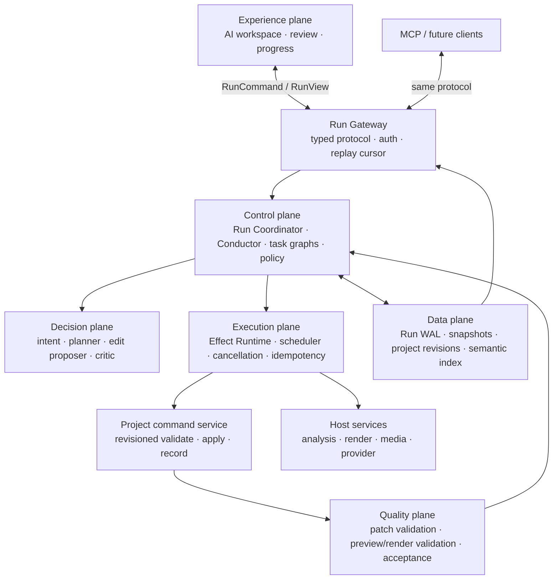
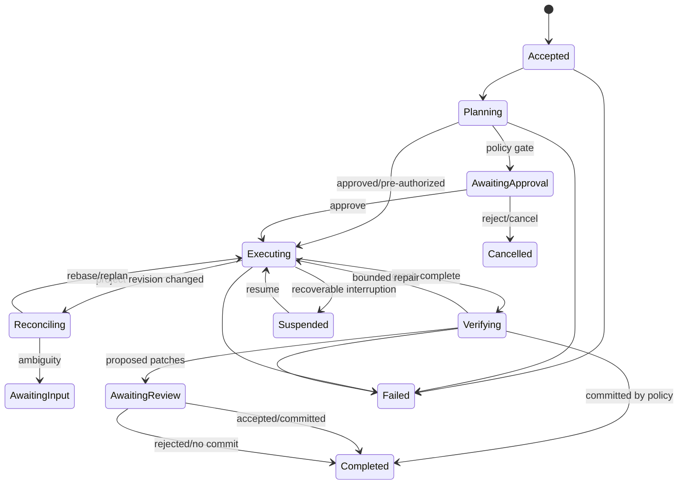

# Orchestration Execution Engine

This is the target architecture for FramePilot's production AI execution system.
It refines the accepted kernel design in [ADR 0044](../adr/0044-orchestration-kernel.md)
and is proposed for adoption by [ADR 0073](../adr/0073-durable-orchestration-runtime.md).
The current-state evidence is in the
[2026-07-23 architecture review](../reports/2026-07-23-orchestration-workspace-architecture-review.md).

## Design thesis

The orchestration engine is a durable workflow runtime for creative work, not a chat
loop. The model proposes bounded decisions. The engine owns state, scheduling, effects,
policy, recovery, and truth. The AI workspace is a synchronized projection of that
engine.

Simple and complex work use the same lifecycle:

- a simple trim compiles to a tiny graph and completes with negligible overhead;
- a documentary edit compiles into hierarchical segments, parallel analyses, review
  gates, renders, and recovery checkpoints;
- both produce the same typed commands, durable events, validated patches, and audit
  trail.

## Planes and responsibilities



### Experience plane

Owns interaction and presentation only:

- composer, plan/task views, tool activity, questions, approvals, diffs, and errors;
- sends typed `RunCommand`s;
- subscribes by `runId` and cursor;
- derives UI solely from `RunView`;
- never executes tools, hosts an orchestrator, or privately records apply decisions.

### Run Gateway

The only client boundary:

- validates command/event schemas and versions;
- authenticates and scopes callers;
- assigns `commandId`/`runId`;
- provides start, subscribe, approve, answer, steer, cancel, resume, and decide-patch;
- supports snapshot + events-since-cursor for reconnect;
- enforces per-client and per-project concurrency policy.

Desktop uses Electron IPC, browser/dev uses an in-process or worker adapter, and MCP uses
HTTP. The protocol and contract tests are shared.

Electron exposes this boundary through a closed preload API: `runStart`,
`runCommand`, `runSnapshot`, `runSubscribe`, `runUnsubscribe`, and `onRunEvent`.
The main-process adapter validates untrusted transport values, license-gates entry,
binds run ownership and subscriptions to the initiating renderer and project, cleans
subscriptions up when that renderer is destroyed, and buffers the narrow
subscribe-registration race so no event can disappear between replay and live delivery.
After a host restart, an exact project id plus the unguessable durable run id can reclaim
the run before snapshot/replay.

Replay is paged at 1,000 events. Live subscriptions acknowledge their highest
contiguous sequence; acknowledgements double as heartbeats. A client may have at most
256 unacknowledged live events before main closes that subscription and emits a
resync-from-cursor instruction. Sixty seconds without an acknowledgement expires the
lease. Subscriptions and recovered ownership remain scoped to the exact renderer,
run id, and project id.

### Control plane

`RunCoordinator` owns the authoritative state machine:

- resolves the request into fast-path recipe, direct edit, plan, or chat;
- compiles work to a versioned task graph;
- schedules tasks by dependencies and resource class;
- applies approval and blast-radius policy;
- folds effect outcomes into state;
- checkpoints after every durable boundary;
- chooses retry, replan, rebase, route-around, pause, or fail;
- emits domain events, never presentation-specific component instructions.

The pure Conductor remains the transition core. It must consume and return serializable
state. Handler closures may not contain hidden run state.

> **What drives it changed in 2026-08 (ADR 0102); what it _is_ did not.** The agent loop
> now runs as a LangGraph `StateGraph` (`kernel/agent-graph.ts`) with one named node per
> effect kind. Each node is a shell: it does its I/O, then calls the same pure decision
> exported from `conductor.ts` that the deleted `runConductor` dispatched to. The reducer
> is still the only place run policy lives, `seq` and event ids are still FramePilot's,
> and the durable WAL is still the single execution authority — the LangGraph checkpointer
> is implemented over it and owns no storage.

The first desktop coordinator slice accepts only protocol-v1 commands. `RunGateway`
assigns unguessable run/command ids and timestamps; `RunCoordinator` serializes each
run, validates project revisions and pending gates, appends the accepted command to the
WAL, reduces it into the canonical snapshot, and publishes only after both durable
writes succeed. Subscriptions begin with snapshot plus events after a cursor, then
receive live events. If the host stopped after WAL append but before snapshot rename,
the coordinator deterministically replays the command tail and repairs the snapshot
before serving it.

Desktop execution no longer expects Promise resolvers or steering queues to cross IPC.
Before starting the legacy model stream, the renderer creates a durable run and attaches
its id. Electron main subscribes an execution adapter to that run. Plan approvals and
model questions first persist a `run.gate_opened` event and awaiting snapshot; approve,
reject, answer, steer, and cancel arrive as validated durable commands. Only after the
coordinator persists and publishes a matching command does the adapter resolve the
temporary execution waiter or enqueue next-turn steering. Browser/dev retains the
in-process control adapters behind the same orchestrator interface.

Stream settlement is also authoritative: completion, failure, timeout, user
cancellation, application shutdown, and process restart are classified in Electron main
and persisted as a `run.terminal` event plus a terminal snapshot before recovery presents
the run again. Renderer loss is deliberately **not** a terminal condition for a durable
run: the renderer detaches while host-owned execution continues, and a replacement
renderer resumes projection from its cursor.
Until the F3 project commit service lands, a stream settlement records
`completed_no_changes`; only revision-checked commits may later claim `changed: true`.

#### Task dependencies own pure-leaf inputs

The compiled task DAG is the single authority for both readiness and data flow. For pure
analysis and patch leaves, the compiler derives an omitted `effect.args.from` binding from
the node's validated `deps`: a single edge binds one upstream result, while a fan-in binds
the ordered result list. If a proposal supplies `from` explicitly, every reference must
also be a declared dependency or compilation fails before any task executes. Patch
assembly folds operations from all bound results in dependency order and then uses the
ordinary schema validation and reversible patch path. See
[ADR 0082](../adr/0082-dag-owned-leaf-input-bindings.md).

#### Model mutation tasks require operations

`propose_edit` is a mutating task contract, so a schema-valid empty `toolCalls` list is an
abstention rather than success. The driver rejects an empty call list or a dispatch that
produces zero typed operations. It makes at most two bounded correction attempts with the
rejected response and exact validation reason appended to the original request. An
exhausted proposal fails that task; dependants such as patch assembly and verification
never become ready, and terminal truth is failed rather than `completed_no_changes`.
Deterministic recipes retain their honest no-op behavior when the requested state already
exists. See [ADR 0083](../adr/0083-empty-planned-mutations-fail-closed.md).

#### Multi-stage mutations use task-local working state and a closed tail

Validated ancestor assemblies are projected immutably onto the base project before a
downstream analysis or model proposal runs. The downstream semantic index and identity
catalog therefore contain clips created earlier in the same DAG. Verification derives its
candidate edit from its own transitive ancestors, avoiding shared completion-order state.

Compilation ensures every model mutation is covered by one final assembly and downstream
verification. Missing closure nodes are appended deterministically, and an aggregate final
assembly combines earlier validated operations with later refinements. A refinement that
exhausts bounded attempts after a validated and verified ancestor checkpoint becomes a
visible warning with zero additional operations; final assembly and verification preserve
the earlier edit. Without that checkpoint, the same exhaustion remains a hard failure. Structured
responses may recover one bounded, schema-valid JSON object from a provider wrapper, but
prose alone is never accepted. See
[ADR 0085](../adr/0085-multi-stage-planned-edit-continuity.md).

### Causal run-state contract

The durable harness status and the task's causal state are separate projections of one
run. Harness status answers what the runtime is doing; `RunWorkingState` answers why any
automated project change is authorized. The latter is versioned and carries immutable
run/conversation/project identity, the original and normalized objective, committed plan
and decisions, execution authorization, plan-bound operations, deliverables,
verification evidence, project revisions, and blocking diagnostics.

| Entering             | Required durable state                                                      | Failure behavior                                                           |
| -------------------- | --------------------------------------------------------------------------- | -------------------------------------------------------------------------- |
| Analyze/plan         | Correlated identity and persisted objective                                 | Pause; do not call the model as an editing continuation                    |
| Apply/enhance/repair | Committed plan, committed decision, authorization, current plan revision    | Block mutating tools and mark the run for review                           |
| Verify               | Committed plan and traceable successful operations                          | Return inconclusive; never report checks passed                            |
| Complete             | Every committed deliverable reconciled, every mandatory verification passed | Persist failed/incomplete terminal truth; do not emit a completion summary |

The detailed planning turn remains a creator-facing option. Disabling it removes the
extra model call and checklist, not the mutation barrier: the conductor commits a minimal
machine-readable plan directly from the persisted request before the first tool turn.
Plan approval, when policy requires it, keeps execution authorization false until the
matching durable approval command settles.

Every operation uses a deterministic idempotency key derived from run, plan, decision,
normalized turn intent, and operation position. A retry that finds a successful ledger
entry does not touch the project again. Project revision conflicts terminate subsequent
automation so later calls cannot execute against stale clip positions.

Reducer boundaries emit `run_state` events. Desktop persists them before renderer
publication, folds the latest value into the run snapshot, rejects regressed versions or
identity mismatch, and deterministically replays them from the WAL. Schema-v1 working
states migrate only from authoritative fields; operations without a committed-decision
record are retained as orphaned rather than retroactively assigned to a fabricated plan.
See [ADR 0081](../adr/0081-run-state-causal-integrity.md).

During the strangler migration, every legacy `AiEvent` is wrapped in a
`run.stream_event` domain event. Electron main awaits WAL append before pushing that
event to the renderer. Full snapshot projection is checkpointed on a lifecycle-status
change and every 50 WAL events rather than rewritten for every token; recovery replays
the bounded tail after the latest checkpoint. Exact consecutive duplicate stream events
are dropped without consuming a sequence number. The compatibility projector advances
non-terminal lifecycle status while terminal truth remains exclusive to
`run.terminal`. This makes the existing visible activity replayable without treating
presentation events as the final Effect Runtime contract.

The desktop renderer stores only a small active-run handle (`runId`, `projectId`,
conversation id, acknowledged cursor). After reload it reclaims the run, requests
snapshot plus paged events after that cursor, filters already-persisted conversation
events by their complete event identity, then switches to acknowledged live delivery.
Resync instructions restart from the last server-accepted cursor. The durable run id
also addresses cancellation after the legacy stream request id has been lost.
Cancellation is a persisted command with a mandatory authorized source (`user_stop` or
`question_dismissed`) and reason. The renderer never sends both that command and the
legacy request-id abort: main observes the durable command first, records its causation,
and only then aborts provider work.

### Lifecycle termination contract

| Ending                    | Durable status | Outcome kind  | Required source                            | Recovery/UI behavior                      |
| ------------------------- | -------------- | ------------- | ------------------------------------------ | ----------------------------------------- |
| Normal finish             | `completed`    | `completed_*` | `run_completed`                            | Show completed result                     |
| Explicit Stop             | `cancelled`    | `cancelled`   | `user_stop`                                | Show intentional stop                     |
| Dismissed question        | `cancelled`    | `cancelled`   | `question_dismissed`                       | Show intentional dismissal                |
| Rejected plan             | `cancelled`    | `rejected`    | `plan_rejected`                            | Show rejected gate                        |
| Provider/internal failure | `failed`       | `failed`      | `provider` / `internal_error`              | Show reason and Retry                     |
| Maximum runtime           | `failed`       | `timed_out`   | `timeout`                                  | Show timeout reason and Retry             |
| Shutdown/restart orphan   | `failed`       | `interrupted` | `application_shutdown` / `process_restart` | Show interruption reason and Retry/Resume |
| Renderer remount/loss     | unchanged      | none          | none                                       | Detach and replay from cursor             |

Terminal reasons are projected back into the conversation as a visible error or
notification before the final status. A generic `cancelled` result is therefore never
used for timeout, crash, shutdown, navigation, or component cleanup.

### Decision plane

Models are replaceable proposers:

- `IntentProposer`
- `PlanProposer`
- `EditProposer`
- `CriticProposer`

Each receives a bounded context slice and returns schema-validated data. Edit proposals
also receive exhaustive, field-shaped asset and track identity namespaces. Registry parsing
proves call shape; project validation of the complete operation batch proves that referenced
assets/tracks/clips exist and that the operations are valid together. A proposal may be rejected
and repaired within a fixed local budget or routed to another tier. It never schedules
itself, applies state, or decides that an effect succeeded. See
[ADR 0084](../adr/0084-project-semantic-proposal-boundary.md) and
[ADR 0085](../adr/0085-multi-stage-planned-edit-continuity.md).

### Execution plane

Every side effect is an `EffectDescription` interpreted by one Effect Runtime:

- model request;
- read/analysis;
- deterministic transform;
- patch proposal/validation;
- project commit/rebase;
- preview/render;
- render validation;
- memory/index update;
- user wait (approval/question);
- persistence.

Each effect declares:

- `effectId` and idempotency key;
- task/run/project identity;
- input and output schema versions;
- resource class and priority;
- timeout, retry class, and cancellation parent;
- side-effect classification (`pure`, `idempotent`, `commit`);
- expected project revision where applicable.

Non-idempotent effects are never retried without a commit token or a recorded outcome.

The production vocabulary is defined in `kernel/effects.ts`: model request, host
analysis, deterministic transform, patch validation/proposal/commit, preview or final
render, verification, user wait, and persistence. Each fine-grained effect carries an
effect/task identity, idempotency key, resource class, timeout, retry class,
cancellation parent, side-effect class, and optional expected project revision. The
coarse `agent` effect remains only as the strangler compatibility wrapper.

`EffectRuntime` accepts the entire fine-grained union. Model and legacy host-tool
effects retain their dedicated typed handlers; every other production effect crosses
one `StructuredEffectExecutor` dependency supplied by the host. Idempotency remains
centralized in the runtime using each effect's declared key, so adding an effect does
not add a client-specific execution switch.

The runtime enforces positive per-effect deadlines, bounded attempts by retry class,
and recursive parent/child cancellation. Commit-class effects are always single
attempt until a recorded commit protocol can prove retry safety. Recording delegates
forward cancellation to the live runtime; replay accepts cancellation as a no-op
because it owns no live provider or host work.

Runtime effects now wrap host analysis/action calls made by both ordinary streaming agent turns and
tool-using question turns. The runtime carries the run-scoped analysis budget into the
trusted host executor, owns successful-result deduplication, and reports cache hits back
to convergence logic; the legacy cache is bypassed on these migrated routes. Agent plan
drafting and the bounded Critic repair completion also run through the same runtime, so
their request, outcome, failure, and cancellation boundaries are durably observable.
Ordinary agent turns use a `model_stream` effect: chunks still reach the workspace
incrementally, while the runtime records their ordered result for replay and emits one
terminal lifecycle boundary. Early consumer termination is recorded as a failed effect,
so cancellation cannot leave an effect permanently shown as running.

Both public agent APIs now allocate one run-scoped runtime. Host calls have no direct
executor fallback and no orchestrator-local `hostCache`; successful-result
deduplication and truthful unavailable-engine outcomes come only from the runtime.
Deterministic read-tool memoization remains separate because it is an in-memory
projection of the current speculative project, not external I/O.

Plan approval and model-authored questions are `user_wait` effects. Their live browser
gates or durable desktop command adapters are supplied as a structured effect executor;
the runtime owns identity, idempotency, deadline, abort propagation, and lifecycle
observation. Missing controls still fail/degrade at the explicit orchestration boundary
instead of creating an unresolvable effect.

An awaited `EffectRuntimeObserver` records request, settled, and failed boundaries.
Desktop maps those callbacks to `run.effect_*` WAL events and the snapshot's effect
projection, using stable structured effect ids and compatibility ids for legacy
model/host effects. Observer failure stops publication/execution rather than producing
an effect outcome that recovery cannot see.

### Data plane

Desktop project revisions are host-owned execution metadata, not fields added to
`project.fp.json`. A `ProjectCommandService` observes validated opens and external file
changes, serializes writes per project, and advances a monotonic revision only when
canonical project content changes. Open/save/change IPC carries that revision; renderer
autosave supplies it as an optimistic precondition, so an MCP or other external change
turns a pending stale save into an explicit `revision_conflict` instead of an overwrite.
The revision registry is atomically checkpointed under Electron user data and restored
before IPC registration. If project content changes while the app is closed, the first
validated observation advances the restored revision instead of resetting it.

The same service now exposes a typed patch commit command. Electron validates the IPC
envelope, resolves the active authoritative project, re-validates operations through
editor-core, applies atomically, schema-validates the resulting project, writes it, and
advances the revision in one project lane. A stale patch is automatically rebased only
when its operations still validate against current state; otherwise it returns an
explicit revision conflict. The typed result distinguishes a disjoint rebase, an
overlapping edit that requires replanning, and a command that lacks active-project/run
authority.

Desktop diff review now uses the authoritative command for single accepts, kept-subset
accepts, batch apply, and auto-apply. The renderer replaces its workspace from the
validated committed project and advances its revision; it never claims success from a
local speculative mutation. Browser/dev retains the checked in-memory editor path.
Desktop auto-apply is an explicit `auto_commit` run policy persisted in the start
command and snapshot. Electron commits each proposed diff before publication, records
the committed or stale lifecycle event, and pushes the resulting project/revision to
the workspace. The React auto-apply effect is restricted to browser/dev.

Desktop AI stream requests for saved projects now carry only `projectId` and expected
revision. Electron resolves the validated project from the command service and rejects
a stale run before provider or host work starts. A new unsaved revision-zero project may
send one bootstrap document so it can be registered; subsequent requests use identity.
Replacing the resolved full document inside orchestration with bounded context handles
remains part of F6.

After desktop review commits successfully, the session sends the patch id and committed
revision back to the durable run. The run snapshot marks that proposal `committed` and
updates terminal truth to `completed_with_changes`; explicit rejection is recorded too.
The last run identity remains available after streaming ends specifically for this
post-run review phase.

Every proposal, accept/reject decision, stale outcome, commit, and rebase is a durable
run event. Authoritative commits use editor-core's project-scoped history path, persist
their inverse, and group consecutive patches from the same durable run into one Undo
entry. The renderer installs the committed project instead of applying the patch again.
An exact commit retry is recognized from that persisted patch identity and returns the existing full
project/revision without another write or compact patch transport. This makes transport retry safe;
a patch-id collision with different content is rejected instead of being treated as a replay.

The data plane has four distinct stores:

1. **Project store:** canonical `Project` plus monotonic revision.
2. **Run store:** append-only versioned WAL and periodic snapshots.
3. **Derived artifact store:** semantic index, transcripts, scene/beat/face/mask data,
   proxies, preview renders—content-addressed where possible.
4. **Conversation store:** a projection/index for history and search, not the run source
   of truth.

The project and run stores are authoritative. UI projections can always be rebuilt.

The desktop `RunStore` persists each run beneath the application data directory as
an fsynced newline-delimited WAL plus an atomically replaced snapshot. Sequence 1 is
the first event; every later event must be contiguous. Repeated event ids are accepted
only when their complete envelopes match, making retries idempotent without hiding
conflicting writes. Both record kinds pass through an explicit one-version-at-a-time
migration registry before protocol validation. A malformed record, sequence gap,
mixed run/project identity, unsupported future version, or snapshot ahead of its WAL
quarantines the entire run directory; recovery never guesses around damaged state.
The snapshot's `workingState` projection is rebuilt from machine-authored `run_state`
events. Its internal version must move monotonically, and its run/project identity must
match the enclosing durable aggregate.

### Quality and policy plane

Policy is deterministic and explicit:

- operation/schema validation before every speculative apply and commit;
- operation/run blast-radius limits;
- approval required by risk, not arbitrary plan length alone;
- render/preview validation gates chosen by edit type;
- Critic judgment supplements deterministic checks;
- user preference can pre-authorize bounded auto-apply, but cannot bypass validation;
- destructive or ambiguous work pauses with a typed reason.

## Canonical contracts

Protocol v1 is implemented in
`packages/ai-sdk/src/run-contracts.ts`. Its strict Zod schemas are the canonical
trust-boundary definitions; the interfaces below are explanatory projections, not
parallel hand-maintained contracts.

### Run command

```ts
interface RunCommandEnvelope {
  schemaVersion: number;
  commandId: string;
  runId: string;
  projectId: string;
  expectedProjectRevision?: number;
  issuedAt: number;
  kind:
    | 'start'
    | 'approve_plan'
    | 'reject_plan'
    | 'answer'
    | 'steer'
    | 'cancel'
    | 'resume'
    | 'accept_patch'
    | 'reject_patch';
  payload: unknown;
}
```

Every command is idempotent by `commandId`. Approval, answer, steering, and patch
decisions are normal durable inputs, not live function objects.

### Domain event

```ts
interface RunEventEnvelope {
  schemaVersion: number;
  eventId: string;
  runId: string;
  projectId: string;
  sequence: number;
  causedByCommandId?: string;
  causedByEffectId?: string;
  projectRevision?: number;
  occurredAt: number;
  kind: string;
  payload: unknown;
}
```

`sequence` is monotonic within a run. Persistence happens before publication for
load-bearing transitions. Clients acknowledge a cursor and can reconnect without losing
or duplicating state.

### Run snapshot

The snapshot contains:

- lifecycle phase and terminal outcome;
- compiled task graph and task states;
- budgets consumed/remaining;
- current project/base revision;
- speculative patch chain and commit decisions;
- pending approval/question;
- context/index references;
- effect attempts and settled outcomes;
- last published sequence.

It contains no raw chain of thought and no provider secret.

## Execution lifecycle

The professional editing control plane refines the durable run states into ten domain stages:

`understand → resolve → inspect → plan → compile → execute → verify → review → repair → finalize`

`kernel/editor-run-lifecycle.ts` is the executable contract. Stage events carry schema version,
run/route identity, monotonic sequence, attempt, evidence, and failure reason. Its pure reducer
rejects settling inactive stages, rewinding, sequence gaps, cross-run events, and work after
finalization. Repair is the sole loop: after a repair stage, execution may re-enter resolve,
inspect, plan, or compile, then proceeds forward again. Every route has an explicit stage policy;
deterministic recipes mark `plan` as `precompiled` rather than bypassing it. This domain lifecycle
will be projected through the existing durable `RunEventEnvelope`; it does not create a second WAL
or orchestration authority.

All mutating host entry points now call `Orchestrator.streamEditorRun`. Its discriminated request
adapts edit, recipe, planned-edit, and agent work while keeping live steering/question/approval
controls outside the serialisable request. Browser sessions, desktop IPC dispatch, renderer-local
recipes, and auto-router handoffs use this boundary. The mature route drivers remain behind it
during migration; a four-route parity fixture proves the adapter yields their exact event sequence
before any driver is retired.



Terminal outcome is separate from creative result:

- `completed_with_changes`
- `completed_no_changes`
- `completed_with_warnings`
- `rejected`
- `cancelled`
- `failed`

The workspace never infers these from an absence of diffs.

## Project consistency

The renderer sends `projectId` and revision, not a full mutable document, on desktop.
The project service supplies a snapshot or scoped read to the run.

At every mutation boundary:

1. validate operations against the run's speculative revision;
2. before commit, compare expected and current project revision;
3. if equal, commit atomically and emit `project_committed`;
4. if changed, classify conflicts;
5. auto-rebase disjoint operations;
6. replan or ask when conflicts overlap;
7. never report applied until the commit event is durable.

Only one commit is active per project. Read/analysis tasks can run concurrently.

## Fast path and complex path

The engine avoids a "small request tax":

- deterministic classifier/known workflow;
- compile one to three task nodes;
- no model when a recipe fully satisfies the request;
- no plan UI unless policy or complexity requires it;
- same run id, WAL, effect runtime, and commit semantics.

Complex workflows use hierarchical graphs:

- project goal → acts/chapters/segments → shots/tasks;
- bounded context and semantic retrieval per node;
- resource-aware parallel analysis;
- checkpoints at segment boundaries;
- partial previews and quality gates;
- aggregate verification at sequence/project level.

Graph size is bounded by paging/expansion: the engine need not materialize every
feature-film task at once.

## Failure and recovery model

Failures are typed:

- provider transient/auth/quota/schema;
- host unavailable/timeout/cancelled;
- validation/revision conflict;
- resource exhaustion;
- policy rejection;
- persistence/transport corruption.

Recovery is a table, not scattered catches:

- retry transient idempotent effects with jitter and provider guidance;
- route to another tier/provider only when policy explicitly permits data egress;
- route around failed independent subgraphs;
- checkpoint and suspend on host loss;
- rebase or replan on revision conflict;
- request user input only for genuine creative ambiguity or authority;
- fail terminally with the last durable checkpoint and actionable reason.

A run has a heartbeat/inactivity lease and resource budgets. It does not rely on an
unbounded process lifetime or a single fixed wall-clock timeout.

## Workspace synchronization

The workspace subscribes to `RunView`, a projection containing:

- exact lifecycle and connection state;
- plan plus evidence-backed task status;
- active/pending effects and progress;
- current/pending questions and approvals;
- proposed patches plus accepted/rejected/stale/committed state;
- warnings, recovery actions, and terminal outcome;
- elapsed time, token/cost totals, and context-trim notices;
- last acknowledged event sequence.

On reconnect:

1. request snapshot at `lastSequence`;
2. replace the local projection from snapshot;
3. replay later events;
4. deduplicate by `eventId`;
5. resume interaction only after the cursor is current.

React state may track ephemeral presentation (expanded rows, draft text, scroll), never
run truth.

## Scale requirements

For feature-length work:

- use project refs/revisions across process boundaries;
- retrieve bounded timeline/index slices;
- store media analysis by content hash and time range;
- page event history and archive terminal runs;
- compact snapshots while retaining an audit WAL;
- cap concurrency per CPU/GPU/FFmpeg/provider resource;
- expose priority and cancellation inheritance;
- measure prompt tokens, memory, event rate, queue latency, and time-to-first-useful
  update against small, long, and pathological fixtures.

## Non-negotiable invariants

The existing five invariants remain. Additionally:

1. the UI never claims a state not present in `RunView`;
2. no effect succeeds without a durable outcome;
3. no patch is applied without a revision-checked commit;
4. no client-specific orchestration policy exists;
5. no recovery path fabricates completion;
6. every run is inspectable and resumable from its last durable boundary.
