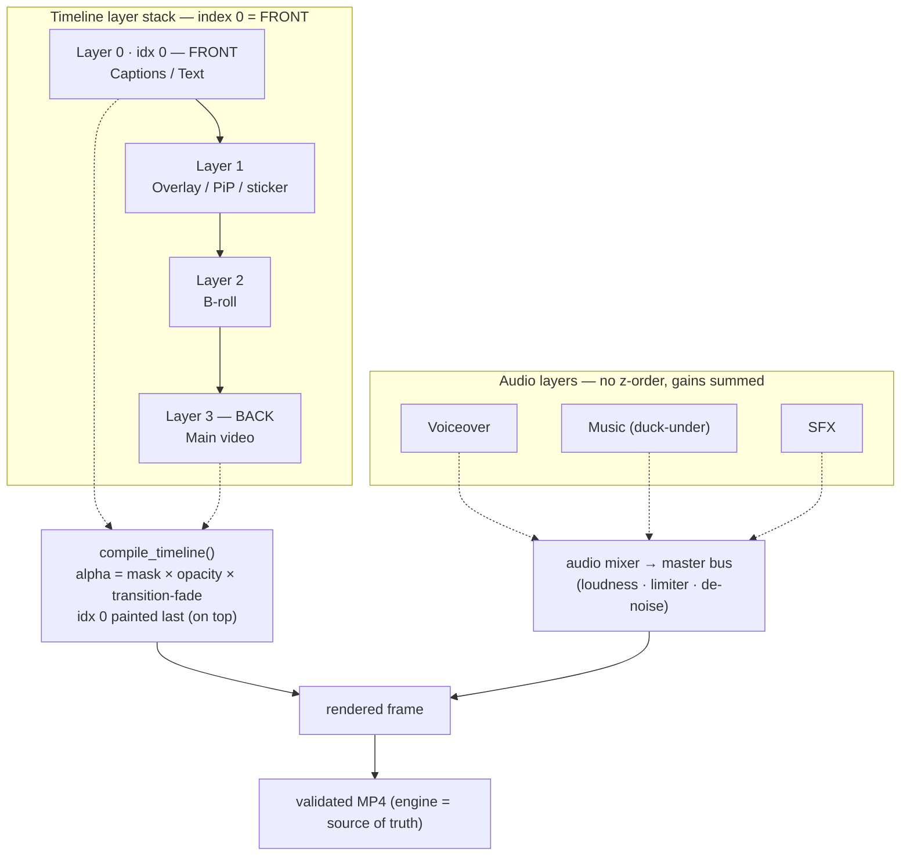
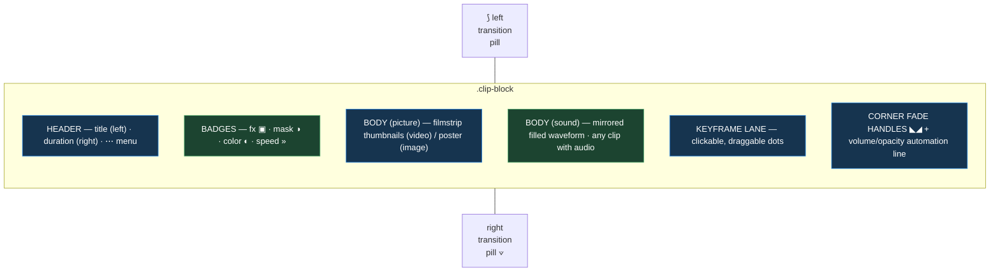
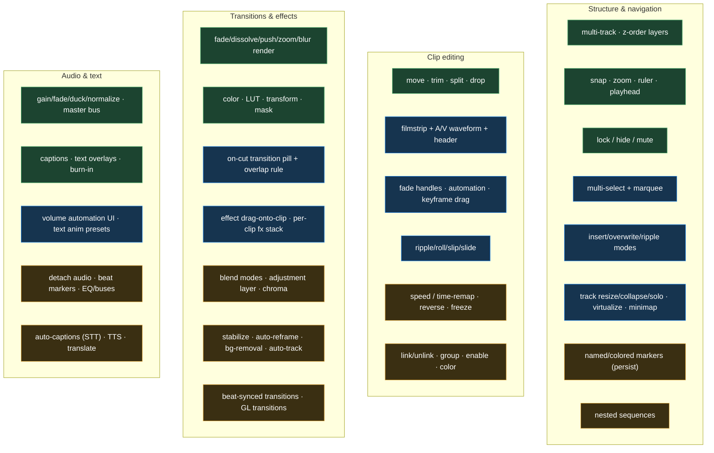
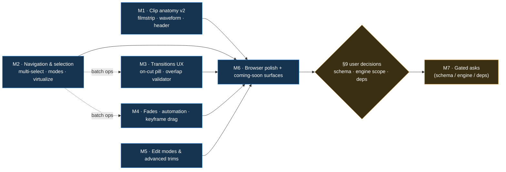

# FramePilot — Timeline Revamp (CapCut / Premiere / DaVinci parity)

> **Sub-plan of `plan/PLAN.md` → Phase 9.5 (Timeline UX + CapCut parity) → Phase 3.**
> Read `plan/PLAN.md`, `AGENTS.md`, and `CLAUDE.md` before working here. This doc is
> both the **goal/spec** and the **execution prompt** for bringing the timeline to the
> bar set by CapCut, Premiere Pro, and DaVinci Resolve — in feature coverage **and** in
> UI/UX precision.
>
> **Legend:** `[ ]` not started · `[~]` in progress · `[x]` done · `[!]` blocked
> **Feature status:** ✅ shipped (engine+UI) · 🟡 engine shipped, UI missing (UI-only work) ·
> 🔨 buildable now (no new dependency; schema additive-or-none) · 🔒 **coming soon** —
> names its required blocker (dependency the user must approve per CLAUDE.md §5, a schema
> migration, or a richer spec). Nothing 🔒 is faked: AI tools stay `available:false`, render
> features are _reported, not silently dropped_, and the UI shows an explicit
> **"Coming soon — requires X"** affordance.

---

## 0. Goal / North Star

> **A creator opens FramePilot and the timeline feels indistinguishable from CapCut/Premiere
> in directness and polish.** Every clip shows its identity at a glance (title, picture,
> sound). Transitions live _on the cut_, draggable and length-adjustable. Effects drag onto
> clips. Multi-select, ripple/insert modes, fade handles, speed, markers — all present or
> visibly "coming soon" with the reason. Nothing surprises: every gesture is one validated,
> reversible patch; the on-disk render always matches what the engine — not the preview —
> can actually do.

This revamp is **UI/UX-led** on top of an already-mature, fully-tested patch engine. We do
**not** rewrite the engine. We (a) finish the _UI_ for capabilities the engine already has,
(b) build the small set of _new_ deterministic engine features that need no new dependency,
and (c) **stub, label, and gate** everything that genuinely needs a dependency/schema the
user must approve.

---

## 1. Grounding — what already exists (do not rebuild)

**Data model** (`packages/timeline-schema/src/index.ts`, **SCHEMA_VERSION 4**; Python mirror
`engine/python/framepilot_engine/timeline/models.py`, parity-tested):

- `Project → Timeline → Track[] → Clip[]`; `Clip` carries `effects[]` + `keyframes[]`.
- `Track`: `type` (advisory role: video/audio/caption/overlay) + `clips[]` +
  `locked`/`hidden`/`muted` flags (v4). **Layers are type-agnostic** (ADR 0032): any clip
  kind on any layer, index 0 = visual front.
- `Clip`: `assetId`, `trackId`, `start`/`end` (timeline), `sourceStart`/`sourceEnd` (source
  in/out), `effects[]`, `keyframes[]`. Text/caption clips use synthetic `__text__`/`__caption__` assets.
- `Effect`: `{ id, type (string discriminator), params (free-form), keyframes[] }`. Known
  types: `color_grade`, `lut`, `transform`, `text`, `caption`, `audio_gain`, `transition`,
  `mask`, `object_track`.
- `Keyframe`: `{ id, time, property, value, easing }` (6 easings).
- `Asset.media` (**read-only, engine-derived**): `proxyPath`, `peaks` + `peaksPerSecond`
  (waveform), **`thumbnailPaths[]`** (filmstrip — field exists, producer exists, not yet
  populated end-to-end).

**Engine ops** (`packages/editor-core/src/operations.ts` + Python mirror — all implemented,
apply+invert, 100% cov): `add_clip`, `trim_clip`, `split_clip`, `move_clip`, `delete_range`,
`ripple_delete`, `add_keyframes`, `apply_color_grade`, `adjust_audio` (gain/fade/mute/normalize/duck),
`add_transition`, `add_mask`, `track_object`, `add_text_overlay`, `add_caption_layer`,
`set_track_flags`, `add_layer`/`remove_layer`/`move_layer`, `restore_clips` (inverse primitive).
Project ops: `add_asset`/`manage_assets`/folders.

**Timeline UI today** (`apps/web-editor/src/components/TimelineView.tsx`, ~1046 lines;
geometry in `editor/selectors.ts`; waveform in `components/ClipWaveform.tsx` +
`waveformRenderer.ts`; tokens in `styles.css`):

- Tracks as lanes (40px), clips as absolutely-positioned `.clip-block` buttons.
- Clip shows: `.clip-label` (title) + `.clip-time` (duration), audio **waveform** (canvas,
  LOD-aggregated, engine-peaks-or-WebAudio), transition bowtie indicator, effect badge
  cluster, keyframe-dot lane, hover trim handles (`.clip-trim-l/-r`).
- Ruler with adaptive ticks (`rulerTicks`), grabbable **playhead** + time bubble, **snapping**
  (8px, Alt-disables, snap guide), **drag-move** (cross-compatible-track), **edge-trim**,
  **razor split** (R), **drag-drop from media bin** with auto-layering, **Cmd/Ctrl+wheel
  cursor-anchored zoom**, zoom-to-fit/clip, per-track hide/mute/lock + layer z-order chevrons.
- **Single-select only.** Track lanes memoized so the 60fps playhead never re-renders the tree.
- Design tokens: Notion-dark palette, `--clip-{video,image,audio,text}`, `--playhead`,
  4px spacing scale, motion tokens, `--z-*` scale, `[data-variant]` Button system. a11y via
  `aria-label`s (no `data-test`); **do not remove the sr-only playhead range input** (seek +
  a11y + test hook).

**Every edit must remain:** one `validatePatch → applyPatch → commitPatch` per gesture;
ephemeral drag/ghost/guide state never committed; preview is HTML/canvas only, the **Python
engine is the sole renderer** (render-vs-preview rule); no schema change without migration +
Pydantic parity + JSON-schema regen + tests + an ADR.

---

## 2. Universal interaction guidelines (apply to every item below)

1. **One gesture → one validated reversible patch.** Build the patch with the existing
   `editor/patch-builders.ts`; route through `useEditor` (`validate → apply → record`). Never
   add a second mutation path. Ephemeral preview state (ghost, snap line, marquee rect) is
   local React state, cleared on `pointerup` (invariant 5).
2. **Respect track flags.** Locked → reject edits (no trim/split/move/drop); hidden/muted →
   render + preview already honor; UI must dim and badge them.
3. **Snapping is universal.** Every horizontal drag (move, trim, transition-length, fade,
   marker) snaps to clip edges, playhead, markers, and sequence start; Alt inverts; show the
   snap guide. Snapping logic stays pure in `selectors.ts`.
4. **Render-vs-preview.** Live preview may _approximate_ (CSS filter for color, opacity for
   fades) but must visibly mark "preview approximate" where it diverges; the truth is the
   engine render. Never compute media in the browser beyond waveform/thumbnail display.
5. **Coming-soon is honest.** A 🔒 feature ships as a real, discoverable control that is
   disabled with a tooltip **"Coming soon — requires {blocker}"**, and its AI tool stays
   `available:false`. It is never silently absent and never faked.
6. **No regressions to the 60fps invariant.** Keep track lanes memoized off the playhead;
   keep waveform/thumbnail rendering on canvas with caching; virtualize vertically once track
   count can exceed the viewport (see M2).
7. **Accessibility parity.** Every new control gets an `aria-label`/role; keep keyboard
   reachability; honor `prefers-reduced-motion`. Preserve all existing hooks.

---

## 3. The clip — exact anatomy & UI spec (the centerpiece)

> **Approved visual reference:** `artifacts/timeline-mock.html` + `timeline-mock.css` — a
> CapCut-style, data-driven mock of this exact layout (full-bleed clips, filmstrip-preview +
> bottom waveform band on video-with-audio, full-width effect/adjustment bars, on-cut
> transition bowties, keyframe-chip row, speed badges, compact icon track headers). It is the
> visual target for the milestones below. **Palette caveat:** the mock uses a CapCut near-black
> palette to read like the reference; the _shipping_ timeline keeps FramePilot's existing
> token system (`styles.css`, Notion-dark, ADR 0028) — adopt the mock's **layout, clip
> anatomy, and density**, not a wholesale re-skin. Any palette shift is a separate, approved
> design-token decision.

CapCut/Premiere render a clip as a _layered card_. FramePilot target, top → bottom, inside
`.clip-block`:

```
┌───────────────────────────────────────────────────────────┐
│ ▸ title (asset/text name)                       0:04.2  ⋯ │  ← header strip (title left, duration right, ⋯ menu)
│ [badges: fx ▣  mask ◑  color ◐  speed »]                  │  ← effect/state badges (top-right cluster, existing)
├───────────────────────────────────────────────────────────┤
│ ▰▰▰ filmstrip thumbnails (video) / poster (image) ▰▰▰      │  ← BODY: picture layer  (🟡 thumbnailPaths exists)
│ ⌒‿⌒‿⌒  mirrored waveform (any clip WITH audio) ‿⌒‿⌒‿      │  ← BODY lower band: waveform overlay (✅ audio; extend to AV)
├───────────────────────────────────────────────────────────┤
│ ◆────────◆ keyframe lane (dots per property)              │  ← keyframe markers (✅ exists)
└─◣ fade-in            volume/opacity line          fade-out ◢─┘  ← corner fade handles + automation line (🟡/🔨)
  ⟆ transition (left junction)        transition (right) ⟇       ← transition affordances at the cut (✅ indicator → 🔨 interactive)
```

**Spec details:**

- **Header strip** (`.clip-header`): title (`assetDisplayName`, ellipsized, tooltip = full
  name) on the left, frame-accurate duration on the right, a `⋯` button opening the existing
  `ClipContextMenu`. Single row, `0.72rem`, `--text-primary`/`--text-secondary`. Hidden when
  the clip is narrower than a min width (collapse to just a color bar).
- **Body — picture layer** (video/image): draw **filmstrip thumbnails** from
  `asset.media.thumbnailPaths` (time-spaced, LOD by clip width, canvas, cached like the
  waveform). Image clips show a single poster frame, tiled/centered. **🟡 Today this is a
  skeleton** — `thumbnailPaths` and the engine producer (`media/derive.generate_thumbnails`)
  exist; needs the desktop import path to populate them and a `ClipFilmstrip` canvas component
  to draw them (mirror `ClipWaveform`'s caching). Fall back to the kind-tinted block.
- **Body — sound layer**: the mirrored, filled waveform (CapCut style — already shipped for
  audio clips via `--clip-audio-wave`). **Extend** so a _video clip that has an audio stream_
  shows a thin waveform band across the bottom third of the body (the picture fills the rest).
- **Keyframe lane**: existing `.clip-keyframes` dots; make them **clickable** to select a
  keyframe and **draggable** horizontally to retime (one `add_keyframes`-shaped retime patch).
- **Fade handles**: top-corner triangular grips (`◣`/`◢`) that drag inward to set audio fade
  in/out (`adjust_audio` fadeIn/fadeOut — engine supports it 🟡) and, for visual clips, an
  opacity fade (opacity keyframes — engine renders opacity ✅). Show the fade as a diagonal
  ramp drawn over the body.
- **Automation line**: a thin horizontal line across the body representing clip
  volume/opacity; drag the line up/down for a constant value, double-click to add a keyframe
  point (rubber-band automation, Premiere-style). 🔨 (keyframe engine already evaluates it).
- **Transition affordances**: see §5.
- **Trim handles**: keep `.clip-trim-l/-r`; add modifier-trims (ripple/roll/slip/slide, §4).
- **States**: selection = accent outline + glow (existing); locked = dimmed + lock glyph;
  disabled (🔒 clip-enable) = hatched; color label (🔒) = left edge color bar.

**Width-adaptive density:** at narrow widths drop the body picture → waveform → header in that
priority; never let labels overflow the card.

---

## 4. Track / layer & navigation UI spec

- **Multi-select** 🔨 (UI/store only, no schema): Shift-click extends, Cmd/Ctrl-click toggles,
  **marquee/rubber-band** drag on empty lane area selects intersecting clips. Move/trim/delete
  operate on the selection as **one patch** containing N ops (the patch envelope already takes
  `operations[]`). Update `editor/store.ts` selection from `string` → `string[]` (keep the
  single-id getter for back-compat).
- **Edit modes toolbar** 🔨: a segmented **Insert vs Overwrite** + **Ripple on/off** control
  (Premiere/CapCut "magnetic"). Insert pushes downstream clips right by the inserted duration
  (build from existing `ripple_delete`'s shift logic, new `insert_clip` composition over
  `add_clip` + shifts — no schema change). Overwrite = current behavior.
- **Track headers**: keep hide/mute/lock + z-order chevrons. Add **track height resize**
  (drag the header's bottom edge) and **collapse/expand** (view-only, persisted to
  `localStorage` via the `useRailLayout` pattern). Add **solo** 🔨 (view/preview-only mute of
  all other audio; no schema — derived).
- **Vertical virtualization** 🔨: once tracks can exceed the viewport, window the lane list
  (reuse `@tanstack/react-virtual`, already a dep) while keeping the playhead-stable memo.
- **Auto-scroll / playhead-follow** 🔨: during playback the viewport scrolls to keep the
  playhead in view (toggle in Settings).
- **Markers** 🔨 (richer than today's seek markers): named, colored timeline markers + a
  marker list; **clip markers**; snap to markers (✅). **Schema note:** persisting named/colored
  markers needs an additive `Project.markers[]` (or `Clip.markers[]`) field → **propose +
  approve (CLAUDE.md §5)** before building persistence; until then markers are view-only.
- **Minimap / overview strip** 🔨: a compressed full-sequence strip under the timeline for
  fast navigation on long projects.
- **Ruler/timecode**: keep adaptive ticks + timecode/seconds toggle. Add **drag-to-zoom on the
  ruler** and **double-click ruler = zoom to fit**.

---

## 5. Transitions — UI/UX spec (explicit user request)

Engine renders cut/fade/cross-dissolve/push/zoom/blur via `render/transitions.py`; attach via
`add_transition` (effect on the incoming clip, `params: { kind, durationSeconds, fromClipId }`).
**Today the UI only shows a static bowtie indicator.** Target:

- **Transitions live ON the cut.** Render a draggable **transition pill** straddling the
  junction between two adjacent clips (centered on the cut, width = transition duration × zoom).
  A transition can also sit at a clip's head/tail if there is no neighbor (fade from/to black).
- **Add by drag-drop**: drag a transition from the Effects/Transitions browser onto a junction
  (or a clip end) → highlights the valid drop zone → drops as one `add_transition` patch.
  Double-clicking a junction inserts the default (cross-dissolve).
- **Adjust duration by dragging** the pill's edges; **the overlap rule is enforced**: a
  transition consumes trailing/leading frames from both neighbors, so its duration ≤ the
  available handle on each side. This is a **validator check** — add `transition_overlap` to
  the patch validator (TS + Python mirror) so an over-long transition is rejected with an
  actionable message (mirrors the existing overlap check). 🔨
- **Transition inspector**: selecting a pill shows kind, duration, direction/easing, and a
  swap-kind dropdown. Right-click → replace/remove.
- **Picker UI**: a categorized transition browser (Dissolve, Slide/Push, Zoom, Blur) with live
  thumbnail/loop previews where cheap; mark engine-unsupported kinds 🔒.
- 🔒 **Beat-/whoosh-synced transitions** — REQUIRES an audio-analysis dependency
  (e.g. `librosa`, Phase 9.0). Ship the control disabled with "Coming soon — requires beat
  detection".

---

## 6. Full feature matrix — CapCut / Premiere / DaVinci coverage

> Each row: capability · status · note/blocker. 🔨 = land in this revamp. 🟡 = UI only. 🔒 =
> coming-soon with named blocker (do **not** build the gated part; build the disabled control).

### 6.1 Timeline structure & navigation

| Capability                                              | Status | Note                                                     |
| ------------------------------------------------------- | ------ | -------------------------------------------------------- |
| Multi-track, type-agnostic layers, z-order              | ✅     | ADR 0032                                                 |
| Adaptive ruler + timecode/seconds                       | ✅     |                                                          |
| Grabbable playhead + time bubble                        | ✅     |                                                          |
| Cursor-anchored zoom (Cmd/Ctrl+wheel), fit, to-clip     | ✅     |                                                          |
| Magnetic snapping (edges/playhead/markers), Alt-disable | ✅     |                                                          |
| Track lock / hide / mute                                | ✅     | schema v4                                                |
| **Multi-select + marquee**                              | 🔨     | store `string[]`, batch patch                            |
| **Insert vs Overwrite + Ripple mode toggle**            | 🔨     | compose over existing shift logic                        |
| **Track height resize / collapse / solo**               | 🔨     | view-only (solo derived)                                 |
| **Vertical virtualization for many tracks**             | 🔨     | reuse react-virtual                                      |
| **Auto-scroll / playhead-follow on playback**           | 🔨     | Settings toggle                                          |
| **Named/colored markers + marker list + clip markers**  | 🔒     | additive `markers[]` schema — propose+approve            |
| **Minimap / sequence overview strip**                   | 🔨     |                                                          |
| Nested sequences / compound clips                       | 🔒     | REQUIRES schema (sequence-as-asset) + compiler recursion |

### 6.2 Clip editing & direct manipulation

| Capability                                           | Status | Note                                                                      |
| ---------------------------------------------------- | ------ | ------------------------------------------------------------------------- |
| Drag-move (cross-compatible-layer)                   | ✅     |                                                                           |
| Edge trim (source-aware)                             | ✅     |                                                                           |
| Razor split (R)                                      | ✅     |                                                                           |
| Drag-drop from media bin + auto-layering             | ✅     |                                                                           |
| Clip title + duration label                          | ✅     |                                                                           |
| **Filmstrip thumbnails (video) / poster (image)**    | 🟡     | `thumbnailPaths` + producer exist; need import-populate + `ClipFilmstrip` |
| **Waveform band on A/V clips (not just audio-only)** | 🔨     | extend `ClipWaveform`                                                     |
| **Fade in/out handles (audio + opacity)**            | 🟡     | engine supports; UI handles missing                                       |
| **Clip volume/opacity automation line**              | 🔨     | keyframe engine ready                                                     |
| **Draggable/retimeable keyframe dots**               | 🔨     |                                                                           |
| **Ripple / Roll / Slip / Slide edits**               | 🔨     | compose over trim+move; new gesture modifiers                             |
| **Clip enable/disable**                              | 🔒     | additive `Clip.enabled` — propose                                         |
| **Clip color labels**                                | 🔒     | additive `Clip.color`/`label` — propose                                   |
| **Speed / speed-ramp (slow-mo, fast-fwd)**           | 🔒     | REQUIRES `Clip.speed`/speed-curve schema + engine time-remap              |
| **Link / unlink audio+video**                        | 🔒     | REQUIRES `Clip.linkId`/group schema                                       |
| **Group / ungroup clips**                            | 🔒     | REQUIRES `groupId` schema                                                 |
| **Freeze frame / hold**                              | 🔒     | REQUIRES speed/time-remap schema                                          |
| **Reverse clip**                                     | 🔒     | REQUIRES engine reverse + schema flag                                     |

### 6.3 Transitions

| Capability                                                    | Status | Note                                  |
| ------------------------------------------------------------- | ------ | ------------------------------------- |
| Cut / fade / cross-dissolve / push / zoom / blur (render)     | ✅     | `render/transitions.py`               |
| **Interactive on-cut transition pill (add/drag/resize/swap)** | 🔨     | §5                                    |
| **Transition overlap validator check**                        | 🔨     | TS + Python                           |
| **Transition browser w/ previews**                            | 🔨     |                                       |
| Beat-/whoosh-synced transitions                               | 🔒     | REQUIRES audio-analysis dep (librosa) |
| 3D / GL transition library (glitch, page-curl, …)             | 🔒     | REQUIRES a GL/shader render path      |

### 6.4 Effects, filters & compositing

| Capability                                                        | Status | Note                                                                     |
| ----------------------------------------------------------------- | ------ | ------------------------------------------------------------------------ |
| Parametric color grade (7 axes) + before/after                    | ✅     |                                                                          |
| LUT preset apply                                                  | ✅     | file import 🔒 LUT-path policy                                           |
| Transform + keyframes (pos/scale/rot/opacity)                     | ✅     |                                                                          |
| Masks (rect/ellipse/poly, feather, animated)                      | ✅     |                                                                          |
| Blur, punch-in/zoom                                               | ✅     |                                                                          |
| **Effect browser → drag effect onto clip**                        | 🟡     | EffectsPanel exists; need drag-onto-clip + per-clip fx list in Inspector |
| **Per-clip effect stack (reorder/toggle/remove) in Inspector**    | 🔨     | over `effects[]`                                                         |
| **Blend modes**                                                   | 🔒     | REQUIRES compositor blend support + `params.blend`                       |
| **Adjustment layer (effect over a time range, all tracks below)** | 🔒     | REQUIRES adjustment-layer clip kind + compiler                           |
| **Chroma key / green screen**                                     | 🔒     | new engine module (numpy-feasible) — propose as engine work              |
| Curves / scopes / shot-match / skin protect                       | 🔒     | advanced color (Phase 9.2)                                               |
| Stabilization                                                     | 🔒     | REQUIRES CV (vidstab)                                                    |
| Auto-reframe (aspect convert)                                     | 🔒     | REQUIRES CV                                                              |
| Background removal / AI subject mask                              | 🔒     | REQUIRES CV/segmentation (SAM 2)                                         |
| Object tracking (auto)                                            | 🔒     | manual seam ✅; auto REQUIRES CV (Phase 9.1)                             |
| Animated stickers / GIF overlays                                  | 🔒     | REQUIRES gif/apng decode in engine                                       |

### 6.5 Text & captions

| Capability                                                       | Status | Note                            |
| ---------------------------------------------------------------- | ------ | ------------------------------- |
| Text overlays                                                    | ✅     |                                 |
| Captions from transcript + styling/templates + keyword highlight | ✅     | style persistence 🔒 schema     |
| Caption burn-in render                                           | ✅     |                                 |
| **Text in/out animations + template presets library**            | 🔨     | keyframes ready                 |
| **Persist caption/text style in schema**                         | 🔒     | additive style fields — propose |
| Auto-captions (speech-to-text)                                   | 🔒     | REQUIRES STT dep (whisper)      |
| Text-to-speech                                                   | 🔒     | REQUIRES TTS dep                |
| Auto-translate / multi-language captions                         | 🔒     | REQUIRES MT dep                 |

### 6.6 Audio

| Capability                                                                  | Status | Note                                                                                               |
| --------------------------------------------------------------------------- | ------ | -------------------------------------------------------------------------------------------------- |
| Gain / fades / duck / normalize / mute                                      | ✅     | `adjust_audio`                                                                                     |
| Master bus: noise-reduce, loudness presets, limiter                         | ✅     | `audio/filters.py`                                                                                 |
| Waveform display                                                            | ✅     |                                                                                                    |
| **Preview audio mix (audio-only tracks audible; footage honors mute/gain)** | ✅     | `PreviewAudioMixer` + `audibleAudioClipsAt`; export audio-bus fix (footage+music mix) — 2026-07-02 |
| **Volume automation line + keyframes (UI)**                                 | 🔨     | engine ready                                                                                       |
| **Audio fade handles (UI)**                                                 | 🟡     | engine ready                                                                                       |
| **Detach audio from video**                                                 | 🔒     | REQUIRES link/group schema                                                                         |
| Beat detection / beat markers                                               | 🔒     | REQUIRES librosa                                                                                   |
| EQ / multiband comp / buses / auto-SFX                                      | 🔒     | REQUIRES audio master spec                                                                         |
| Voice changer / pitch                                                       | 🔒     | REQUIRES dep                                                                                       |

### 6.7 Render / export (context — not timeline UI)

| Capability                                            | Status | Note                                            |
| ----------------------------------------------------- | ------ | ----------------------------------------------- |
| Preview render, final export, presets (9:16/1:1/16:9) | ✅     | Python engine, validated                        |
| In-editor preview render into Review UX               | 🔒     | renderer→engine preview IPC channel (Phase 9.3) |

---

## 7. Execution plan — milestones (each = own PR, DoD met, tests green)

> Build order: **UI-for-existing-engine first** (highest value, lowest risk, zero schema),
> then **new no-dependency engine features**, then **gated asks** (only after approval).
> Mark `[~]` in `plan/PLAN.md` Phase 9.5 → Phase 3 before starting each.

### M1 — Clip anatomy v2 (picture + sound + header) 🟡🔨 — [x] DONE incl. real previews (2026-06-30)

> Clip-anatomy UI complete (picture layer + waveform band + header strip + adaptive
> density) AND real thumbnail previews wired end-to-end (engine produces thumbnails →
> desktop `importAsset` IPC carries the derived `AssetMedia` → renderer draws frames via
> `fp-media://`). Security-reviewed (SAFE TO SHIP). The skeleton remains only the honest
> fallback when no media has been derived yet.

- [x] **Slice 1 (2026-06-29):** picture + sound on video clips. Pure `clipFilmstripFrames`
      selector (maps the clip source window onto `media.thumbnailPaths`; `[]`→skeleton), a
      `ClipFilmstrip` component (frames when present, **skeleton fallback** otherwise — honest,
      no browser media compute), and a `variant="band"` mode on `ClipWaveform` so video clips
      get a bottom waveform band while audio keeps the full waveform. Wired in `TimelineView`
      (filmstrip for video/image, band wave for video), token-based CSS, gated by a min clip
      width. Presentation-only; 60fps memo preserved. web-editor **407 tests green**, typecheck
  - lint clean, coverage held. _Design fork:_ an in-bounds source window that slices empty
    returns the first frame (not `[]`) so picture never degrades to skeleton spuriously.
- [x] **Slice 2 (2026-06-30):** real thumbnail previews — user-approved the desktop
      media-import IPC broadening (CLAUDE.md §5). Engine `/asset-media` now produces video
      thumbnails (`.framepilot-derived/<sha1>/thumbs`, project-root-relative, idempotent;
      image→own path, audio→none, failures degrade) — engine **435 tests, 99% cov**. New desktop
      `importAsset` IPC channel + pure `asset-media-client` + bridge + Media-bin wiring carries
      the derived `AssetMedia` onto the asset; renderer serves frames via `fp-media://`
      (`ClipFilmstrip` fixed to wrap paths in `mediaSrc`). shared-types 19 / desktop 104 /
      web-editor 426 green; cross-package typecheck green. **Security review: SAFE TO SHIP** —
      every path hop sandboxed, fp-media re-validates containment at read time. Fixed the one
      LOW finding (asset-media-client no longer forwards the upstream sandbox-error body to the
      renderer). _Non-blocking follow-up:_ add an ffmpeg timeout to `/asset-media` thumbnail
      derivation (tracked in PLAN.md security backlog).
- [x] **Slice 3 (2026-06-29):** header strip + width-adaptive density. Title + duration +
      a `⋯` actions control (focusable `role="button"` span — nested `<button>` is invalid;
      reuses the existing `select`+`setMenu`→`ClipContextMenu` flow, no new mutation path) in a
      top `.clip-header` row with a legibility gradient. Pure `clipHeaderDensity(widthPx)` tiers:
      sliver (<24px) bare block · narrow (24–55) title only · medium (56–95) +duration · wide
      (≥96) +`⋯`. Title always ellipsizes; badges nudged below the header. web-editor **416
      tests green**, typecheck + lint clean, every new branch covered; 60fps memo preserved.
- DoD: no playhead-tick re-render (met); a11y labels + hooks intact (met); visual-regression
  baselines updated when the desktop harness runs (none in the web-editor unit package).

### M2 — Navigation & selection 🔨 — [x] DONE (2026-06-30)

> Split into **M2a** (multi-select + marquee + batch move/delete — selection model) and
> **M2b** (edit modes insert/overwrite/ripple + track resize/collapse/solo + auto-scroll +
> minimap + virtualization). Sequential (both edit `TimelineView.tsx`).

- [x] **M2a (2026-06-30):** multi-select + marquee + batch move/delete. Store gained
      `selectedIds` + primary `selection`; `select(id, 'replace'|'toggle'|'add')`, `selectMany`,
      `clearSelection`. Marquee = pure `clipsIntersectingRect` + ephemeral rect (cleared on
      pointerup). Batch `deleteClipsPatch`/`moveClipsPatch`/`duplicateClipsPatch` each emit ONE
      patch with N ops (ripple ops back-to-front, move ops in travel direction so the validator
      accepts atomically); one undo reverts the batch. Shift/Cmd-click, Esc clears, Delete±ripple
  - ⌘D act on the set. 60fps memo preserved (lanes read a `selectedSet`, not playhead).
    web-editor **455 tests green**, typecheck + lint clean, coverage held. _Deferred to e2e:_
    real pointer-marquee DOM hit-testing (jsdom lacks `elementFromPoint`/real rects).
- [x] **M2b-1 (2026-06-30):** edit modes. Insert/Overwrite segmented control + Ripple toggle
      in the timeline tools, session-persisted (`localStorage framepilot.editMode`, not in undo
      history / project). `insertClipPatch` composes `add_clip` + downstream `move_clip` shifts
      into ONE patch (furthest-downstream-first so no transient overlap; Overwrite path
      unchanged). Ripple toggle flips Delete's default; Shift inverts. web-editor **479 tests
      green**, typecheck + lint clean, coverage held. MediaBin "Add" honors Insert at the
      playhead on the frontmost compatible lane.
- [x] **M2b-2 (2026-06-30):** track & viewport (all view-only, zero patches). Per-track
      height resize + collapse + audio **solo** (derived preview-mute via `resolveSoloMutedTrackIds`
      — never touches `Track.muted`), persisted in `localStorage framepilot.trackLayout`;
      **auto-scroll/playhead-follow** (rAF, imperative `scrollLeft`, suspends during scrub/manual
      scroll via pure `shouldAutoFollow`/`nextAutoScrollLeft`, Settings toggle); **minimap**
      overview strip (pure geometry + draggable viewport window); **vertical virtualization**
      (`@tanstack/react-virtual`, header column windowed in lockstep, `trackLanes` memo still
      excludes playhead, aria hooks preserved). web-editor **510 tests green**, typecheck + lint
      clean, coverage held. _Noted:_ solo drives UI only (web preview has no audio mix yet);
      pointer-precise minimap/auto-scroll behavior covered by pure selectors, full pointer paths
      deferred to the Playwright harness.
- DoD: batch move/delete = single patch, undo reverts all (met in M2a); 60fps memo preserved;
  pointer-marquee + edit-mode e2e land with the Playwright harness.

### M3 — Transitions UX 🔨 — [x] DONE (2026-06-30)

> Split into **M3a-engine** (`transition_overlap` validator + idempotent `add_transition`,
> TS `editor-core` + Python mirror, parity/round-trip) and **M3b-ui** (on-cut pill, browser,
> inspector). Engine first so the UI builds on a correct, non-stacking validator.

- [x] **M3a-engine (2026-06-30):** `transition_overlap` validator check (a clip's
      `transition` effect must reference an adjacent earlier same-track clip and its
      `durationSeconds` ∈ (0, min(thisClip, fromClip) duration]) + `add_transition` made
      idempotent-by-id (replace-in-place, mirroring `apply_color_grade`) so a resize never
      stacks. TS + Python mirror, parity + apply→invert round-trip, 100% cov. Verified:
      editor-core 172 tests, engine 435 tests green.
- [x] **M3b-ui (2026-06-30):** on-cut transition pill — pure selectors
      (`timelineTransitions`/`transitionMaxDuration`/`trackJunctions`/`clipTransition`) drive a
      self-contained `TransitionPill` that straddles the cut (centred, width = duration), selects
      the incoming clip on click/Enter, and resizes the duration symmetrically about the cut as
      ONE `setTransitionDurationPatch` on pointer-up (ephemeral drag state, clamped to the
      validator's `min(neighbour)` so a drag never produces a rejected patch). Empty butt-joined
      cuts get a hover affordance that adds the default cross-dissolve on double-click or on a
      drop from the browser. Patch-builders `setTransitionDurationPatch`/`swapTransitionKindPatch`
      (idempotent re-issue) + `removeTransitionPatch` (reversible via `restore_clips`). Inspector
      gained a **Transition** section (kind swap = immediate patch, duration via local-state +
      Apply mirroring the audio/color panels so a scrub is one patch, Remove). EffectsPanel
      transition tiles are now **draggable onto a cut** and a disabled **Beat-synced** tile shows
      "Coming soon — requires beat detection". Old in-clip bowtie indicator removed (the pill
      replaces it). web-editor **525 tests green** (selectors/patch-builders/component), typecheck
  - lint clean, 60fps memo preserved (transitions grouped in a `timeline`-keyed memo, not the
    playhead). _Deferred to the Playwright harness:_ pointer-precise drop-on-junction + undo e2e
    (jsdom lacks real rects), as with M2.
- DoD: over-long transition rejected with actionable error (M3a + builder test);
  apply→invert round-trip (builder + undo tests); drop-on-junction → resize → undo e2e lands
  with the Playwright harness.

### M4 — Fades, automation & keyframe direct-manip 🟡🔨

- Fade in/out corner handles (audio fade + opacity ramp); volume/opacity automation line;
  draggable/retimeable keyframe dots; per-clip effect stack in Inspector (reorder/toggle/remove).
- DoD: each gesture one patch; preview shows approximate fade with "preview approximate" note;
  engine render is the truth.

### M5 — Edit modes & advanced trims 🔨

- Insert vs Overwrite + Ripple toggle; ripple/roll/slip/slide trim gestures (compose over
  existing trim+move; add `insert_clip` composition — no schema change).
- DoD: insert pushes downstream by exact duration; slip keeps clip position + duration while
  changing source in/out; all reversible; unit + e2e.

### M6 — Effect/transition browser polish + coming-soon surfaces 🔨🔒

- Drag-effect-onto-clip; categorized browsers; **disabled "Coming soon — requires X"**
  controls for every 🔒 row (speed, link/group, blend modes, chroma, auto-reframe, beat-sync,
  STT/TTS, adjustment layer, nested sequences, markers-persist). Each tooltip names its blocker
  and links to the Phase 9.0 gating decision.
- DoD: no 🔒 feature is silently missing; all are discoverable + disabled + explained; AI tools
  for them remain `available:false`.

### M7 — Gated asks (ONLY after the user approves — CLAUDE.md §5)

> These need a dependency, a schema migration, or a richer spec. **Do not implement without
> sign-off.** Listed so the disabled UI from M6 can be lit up deliberately.

- Schema (additive, each = migration + Pydantic parity + JSON-schema regen + tests + ADR):
  `Clip.enabled`, `Clip.color`/`label`, `Clip.speed`/speed-curve, `Clip.linkId`/`groupId`,
  `Project.markers[]`, caption/text style persistence, adjustment-layer clip kind.
- Engine (no dep, but new render code + golden tests): chroma key, time-remap/speed, reverse,
  blend modes, adjustment-layer compositing.
- Dependency-gated (Phase 9.0): CV (auto-track/segmentation/stabilize/auto-reframe), audio
  analysis/librosa (beat sync), STT/TTS/MT, LUT-file-path policy, advanced audio master spec,
  GL/shader transitions.

---

## 8. Definition of Done (per the project bar)

- Every gesture routes through `validate → apply → record`; one reversible patch per action;
  undo/redo exact. No second mutation path. Ephemeral preview state never persisted.
- TS: `pnpm typecheck` + `pnpm lint` clean (vs known baseline); affected package tests + 100%
  on touched core deterministic modules; new selectors/patch-builders unit-tested pure.
- Python (only if engine touched): `pnpm engine:test/lint/typecheck`; new render code has a
  **golden-media** test; validator parity (TS↔Python) tested.
- e2e: pointer-driven Playwright spec for each new gesture (drop-transition, marquee, fade,
  slip) asserting the observable outcome + undo; visual-regression baselines updated.
- Any schema change: migration + Pydantic parity + `project.schema.json` regen + ADR + approval.
- Any new dependency: `pnpm license:scan` green + explicit approval (CLAUDE.md §5).
- Docs: ADR for each architectural decision; `CHANGELOG.md`; check off this file + PLAN.md.
- **No 🔒 feature faked.** Disabled control + "Coming soon — requires X" + `available:false` tool.

---

## 9. Open decisions for the user (resolve before M7)

1. **Schema additions** (additive, low-risk, but each is a migration): clip enable, color
   label, speed, link/group, project markers, caption-style persistence, adjustment layer.
   Approve as a batch or piecemeal?
2. **New engine modules without a new dependency** (chroma key, speed/time-remap, reverse,
   blend modes): in-scope for this revamp or defer to Phase 9?
3. **Dependency approvals** (Phase 9.0): CV (OpenCV/SAM 2), audio analysis (librosa),
   STT/TTS/MT, GL transitions, LUT-file-path policy. Which, if any, to greenlight now?

---

## 10. Diagrams (how the layers & functionality tie together)

> These render on GitHub and in any Mermaid-aware viewer. Status colors:
> 🟩 shipped · 🟦 build now · 🟨 coming soon (gated).

### 10.1 Compositing layer stack (z-order)

Type-agnostic layers (ADR 0032): **index 0 is the visual front**; `compile_timeline()`
composites top→bottom. Audio layers have no z-order — their gains sum on the master bus.



### 10.2 Clip anatomy (the `.clip-block` card)



### 10.3 The unifying pipeline — every gesture funnels through one path

This is the realism check: transitions, fades, multi-select, effects, **and** AI/MCP all
converge on the same validate→apply→record→render flow. No gesture gets a side door.

```mermaid
flowchart LR
    subgraph G["User & AI gestures"]
        direction TB
        g1["drag-move / trim / split / razor"]
        g2["drop transition on a cut"]
        g3["fade handle / automation line"]
        g4["multi-select → batch edit"]
        g5["drag effect onto clip"]
        g6["AI panel / MCP tool call"]
    end
    G --> PB["patch-builders.ts<br/>→ Operation[]"]
    PB --> ENV["Patch envelope<br/>{ patchId, createdBy, reason, operations[] }"]
    ENV --> V{"validatePatch<br/>refs · negative-dur · overlap ·<br/>transition_overlap · track-lock · reversible"}
    V -- invalid --> REJ["reject → error toast<br/>(nothing mutates)"]:::soon
    V -- valid --> AP["applyPatch — pure, immutable"]:::done
    AP --> REC["commitPatch → undo/redo stack"]:::done
    REC --> STORE["useEditor store"]
    STORE --> PREV["Preview — HTML/canvas, *approximate*"]:::now
    REC --> SAVE["project.fp.json (atomic write)"]:::done
    SAVE --> ENG["Python engine<br/>compile_timeline → MoviePy/FFmpeg"]:::done
    ENG --> RV["validate_render → truth"]:::done
    classDef done fill:#1c4430,stroke:#4dab6d,color:#fff
    classDef now fill:#16344f,stroke:#2383e2,color:#fff
    classDef soon fill:#3a2f12,stroke:#d9a23b,color:#fff
```



### 10.4 Feature map by status



### 10.5 Milestone dependency graph



---

_Last updated: 2026-06-30 — M3 (Transitions UX) complete: M3a-engine (`transition_overlap`
validator + idempotent `add_transition`, TS+Python parity) and M3b-ui (on-cut transition pill
with drag-resize, double-click/drop-to-add at cuts, transition inspector section, draggable
browser tiles, coming-soon beat-synced control). M1 + M2 + M3 shipped; next up M4 (fades,
automation, keyframe direct-manip). Status: spec + visual target locked; §9 decisions still
pending for M7._
