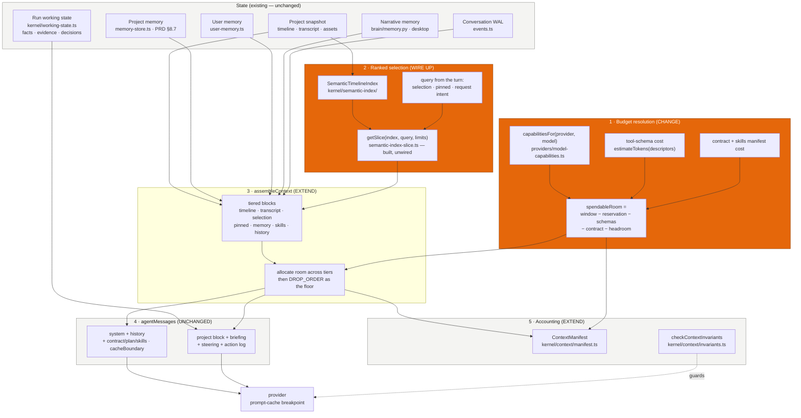

# Context management — diagnosis and benchmark

> **Sub-plan document.** Created 2026-08-26. The evidence base for
> [`README.md`](./README.md) and the five phases beside it.
> Parent entry: `plan/PLAN.md` → **CTXBENCH**.
> **Nothing here is a proposal to implement.** §4 sketches the architecture the phases
> execute; the phase files own the sequencing, scope gates and acceptance evidence.

Date: 2026-08-26 · Branch: `fix/agent-run-gap-analysis` · Scope: `packages/ai-sdk`, host context wiring in `apps/web-editor` / `apps/desktop`, `engine/python/framepilot_engine/brain`

Reproduce every figure in this report:

```bash
pnpm --filter @framepilot/ai-sdk build          # dist/ must be current
node packages/ai-sdk/scripts/context-benchmark.mjs --json reports/context-benchmark-baseline.json
```

Baseline artifacts: [`reports/context-benchmark-baseline.txt`](../../reports/context-benchmark-baseline.txt) (human-readable) and [`reports/context-benchmark-baseline.json`](../../reports/context-benchmark-baseline.json) (machine-diffable). The harness is deterministic — no network, no provider key, no model judgement — and two consecutive runs produce byte-identical JSON.

---

## 0. Verdict up front

The working hypothesis was that context management is weak and that this is what makes AI-generated edits cheap. **The hypothesis is half right, and the half that is right is not the half that was assumed.**

What is _not_ weak: the tiering, budgeting, compaction, run-memory, invariant-checking and manifest machinery in this codebase is unusually complete. `assembleContext` tiers and drops by priority; `compactAgentLog` clears re-derivable payloads and rolls a window; `kernel/briefing.ts` distils reads into durable facts instead of hoarding payloads; `kernel/context/invariants.ts` refuses to send an amnesiac prompt; `kernel/context/manifest.ts` accounts for every token including tool schemas. Structurally this is closer to Claude Code's harness than to a naive chat wrapper.

What _is_ weak, and what the benchmark measures:

> **The context budget is spent almost entirely on the harness, and almost not at all on the user's video — while ~114,000 tokens of the model's window sit unused.**

On a 60-minute project, one planning turn costs ~22,300 tokens. **1,346 of them (6.0%) describe the user's footage.** 17,490 (78%) are tool schemas. The model is shown **2.1% of the timeline's clips and 6.7% of its dialogue** — not because the window is full, but because the caps that produce those slices are hardcoded constants that were never connected to the budget that would have told them they could afford more.

And when the model does the correct thing — calls `get_transcript` to read what was actually said — it gets **25 words out of 1,500 back**, cut mid-JSON, with no count and no instruction to narrow.

That is a sufficient explanation for "cheap results" without invoking model choice or prompt wording at all. An agent asked to find the strongest hook in a ten-minute recording, which can see the first 40% of the transcript ambiently and 1.7% of it through the tool built for the job, will produce a hook from the first two minutes. Every time. It is not reasoning badly; it is reasoning correctly about a keyhole view.

---

## 1. Discovery: how a model call is actually assembled today

Two assembly paths exist, and they are genuinely different.

### 1.1 The single-shot path — `assembleContext`

`packages/ai-sdk/src/context-builder.ts:430`. Used by `streamChat`, `streamPlan`, `streamEdit`, `streamEditVariations` (`orchestrator.ts:4480, 4661, 5139, 5208`).

It builds a mandatory head (project header, target platform), then droppable tiers, then the user request:

| Tier         | Content                                                       | Source                                            |
| ------------ | ------------------------------------------------------------- | ------------------------------------------------- |
| `timeline`   | layer-by-layer clip summary, visual-index status, footage map | `summarizeTimeline`, host-supplied digests        |
| `transcript` | transcript slice                                              | `summarizeTranscript`                             |
| `selection`  | selected range, editor interaction state                      | `interaction-context.ts`                          |
| `pinned`     | `@`-picked clips/assets (browser only)                        | composer                                          |
| `memory`     | project memory (typed) + session context (narrative)          | `memory-store.ts`, brain `/brain/session-context` |
| `skills`     | 21-skill manifest; bodies fetched via `load_skill`            | `skills.ts` (ADR 0057)                            |
| `history`    | last 8 user/assistant turns                                   | `boundedHistory`                                  |

It then drops whole tiers in `DROP_ORDER` (`transcript → timeline → skills → memory → history → pinned → selection`) until the estimate fits the budget, and reports what it dropped in `AssembledContext.sections`.

### 1.2 The agent path — `agentMessages`

`orchestrator.ts:2405`. This is the path that produces edits, and it does not simply call `assembleContext` — it calls `buildContext` and then restructures the result for prompt-cache stability:

```
[ system contract ]                      ← stable
[ …bounded conversation history ]        ← stable within a run
[ agent contract + plan + pinned skills ] ← stable within a run, cacheBoundary: true
[ project block + briefing + steering + action log + frames ]  ← varies every turn
```

Plus the tool schemas, which the provider places above the messages in the cache hierarchy.

The turn-varying tail is the interesting part. It carries three distinct memories:

- **`buildContext`'s project block** — re-rendered every turn from the _mutating_ working copy, so it always reflects the timeline as it now is.
- **The state briefing** (`kernel/briefing.ts`, ADR 0075) — the run's durable memory: objective, committed decisions, distilled facts, evidence handles, next action. Bounded by construction, not by truncation. This is the genuinely good part of the design.
- **The action log** (`compactAgentLog`) — a rolling 6-entry window; above 1,000 estimated tokens, re-derivable payloads older than the last 2 entries are replaced with `[old result cleared — call recall_evidence("ev_N")]`.

### 1.3 Memory that outlives a run

- **Project memory** (PRD §8.7, `memory-store.ts` → `Project.aiMemory`): typed editorial preferences plus accepted/rejected patch ids. Layered under cross-project `user-memory.ts` by `scoped-memory.ts` (project wins field by field).
- **Narrative memory** (`engine/python/framepilot_engine/brain/memory.py`): append-only `corrections.md` / `decisions.md` / `session_notes/<date>.md`, size-capped at 64 KB and truncated oldest-first. Written via `POST /brain/memory` from `createMemoryRecorder`; read back as the `sessionContext` prompt block. **Sidecar-gated — desktop only.**
- **Run working state** (`kernel/working-state.ts`): persisted per run as a `RunSnapshot` for crash recovery, restored _only_ via `agentOptions.resume` when a checkpoint carries ops (`conductor.ts:928`).

### 1.4 Existing evaluation infrastructure

Confirmed present and reusable, so no parallel harness was built:

- `src/__fixtures__/golden-sessions/*.json` + `kernel/replay/golden-corpus.test.ts` — nine recorded sessions replayed against live `streamAgent`, regenerated with `FRAMEPILOT_GOLDEN_UPDATE=1`.
- `kernel/replay/golden-session.ts` — `compareSessions` / `serializeSession`, designed to be loadable as data rather than as a snapshot.
- `kernel/cost/{cost-meter,run-metrics,usage-summary}.ts` — per-run token and cost accounting.
- `kernel/context/manifest.ts` — per-request section accounting, including `toolSchemaTokens`, with `diffManifests` for before/after comparison.
- `ScriptedProvider` pattern (`streamAgent-golden.test.ts:33`) — a provider double that replays a fixed script.

The benchmark in §3 is built from these pieces: a recording variant of `ScriptedProvider`, the manifest's own token estimator, and the same synthetic-project shape the fixtures use.

---

## 2. Diagnosis

Findings are marked **[C]** confirmed by executed measurement or by a traced code path, **[I]** inferred.

### F1 — Ambient project state is capped by constants, not by the budget **[C]**

`MAX_CLIPS_PER_LAYER = 12` and `MAX_TRANSCRIPT_WORDS = 600` (`context-builder.ts:127,135`) are compile-time constants. They do not consult `ContextBudget`, the selected model, or the remaining capacity the manifest already computes.

| Project scale | Clips | Shown | Coverage  | Words  | Shown | Coverage  | State tokens |
| ------------- | ----- | ----- | --------- | ------ | ----- | --------- | ------------ |
| 1 min         | 19    | 16    | **84.2%** | 150    | 150   | **100%**  | 396          |
| 10 min        | 188   | 24    | **12.8%** | 1,500  | 600   | **40.0%** | 1,345        |
| 60 min        | 1,125 | 24    | **2.1%**  | 9,000  | 600   | **6.7%**  | 1,346        |
| 4 h           | 4,500 | 24    | **0.5%**  | 36,000 | 600   | **1.7%**  | 1,348        |

The state-token column is the point: it is **flat**. The project view costs the same ~1,350 tokens whether the video is ten minutes or four hours. The design intent (plan `AI-ORCHESTRATION-REDESIGN.md` K2.2, done 2026-07-07) was explicitly "O(slice), not O(timeline)" — and it succeeded. What was never added is the other half: letting the slice _grow_ when there is room.

The 10-minute row is FramePilot's own north-star benchmark case (`.agents/rules/product-discipline.mdc` §1: "a real 5–15 minute source recording → a polished 30–90 second short with a strong hook"). For that case the model is shown **12.8% of the cuts and 40% of the words.**

### F2 — The budgeter is blind to ~80% of the prompt **[C]**

`assembleContext`'s `cost()` sums the system prompt, the tier blocks, the history and the user request. It does **not** include:

| Not counted by the budgeter                     | Tokens      |
| ----------------------------------------------- | ----------- |
| Tool schemas (planning stages, 84 tools)        | **17,490**  |
| Tool schemas (execution stages, 62 tools)       | 13,431      |
| Agent contract (`agentModeInstruction`, vision) | 1,775       |
| Pinned skill bodies (top 8 of 21)               | up to 6,728 |

Meanwhile `kernel/context/manifest.ts:359` _does_ count tool schemas, and its own docstring names the reason: "a tool set is real prompt cost, and leaving it out was one reason the old indicator under-reported." The reporting layer was fixed. The deciding layer was not. The two now disagree about the same request by roughly 20,000 tokens.

Fixed per-turn overhead, agent mode, before a single word about the video: **20,987 tokens.**

### F3 — `ContextBudget` is never set by any production caller **[C]**

Grepping `packages` and `apps` for `ContextBudget` / `budget:` on a `ContextInput` returns **only test files**. Every real request therefore trims against `DEFAULT_CONTEXT_BUDGET` = 190,000 window − 4,096 output − 2,000 headroom = **183,904 tokens**, for every provider and every model.

`providers/model-capabilities.ts` exists precisely to end this — its docstring calls the hardcoded 190,000 "wrong in both directions" — and `contextWindowFor()` (`orchestrator.ts:273`) does resolve the real window. But it resolves it **for the manifest**, not for the trimmer.

| Provider / model               | Real room | Budgeter assumes | Delta        | Failure mode    |
| ------------------------------ | --------- | ---------------- | ------------ | --------------- |
| anthropic / claude-opus-4-5    | 136,000   | 183,904          | +47,904      | trims too late  |
| openai / gpt-4o                | 111,616   | 183,904          | +72,288      | trims too late  |
| groq / llama-3.3-70b-versatile | 98,304    | 183,904          | +85,600      | trims too late  |
| ollama / qwen2.5-coder         | 24,576    | 183,904          | **+159,328** | trims too late  |
| openrouter / unknown model     | 119,808   | 183,904          | +64,096      | trims too late  |
| google / gemini-2.5-pro        | 983,040   | 183,904          | −799,136     | trims too early |

Today this is latent rather than active, because F1 keeps prompts around 22K and the trimmer never fires. It becomes a hard failure the moment F1 is fixed and the slices are allowed to grow — which is why F3 must be fixed _first_.

### F4 — `get_transcript` returns 1.7% of the transcript, silently **[C]**

`summarizeReadResult` (`orchestrator.ts:1499`) has hand-written digests for 29 tools that preserve every id and append an explicit `(… N more … ; narrow the query)` tail. Nine read/analysis tools have **no case** and fall through to `previewJson(value, 1200)` — a blind 1,200-character slice of the raw JSON:

`get_frame`, `get_selected_range`, **`get_transcript`**, `index_media`, **`map_footage`**, `measure_color`, **`read_edit_signals`**, `track_subject_automatically`, `transcribe`.

Measured:

| Tool                         | Records in  | Surfaced | Fidelity | "N more" tail?        |
| ---------------------------- | ----------- | -------- | -------- | --------------------- |
| `get_transcript`             | 1,500 words | **25**   | **1.7%** | no                    |
| `read_edit_signals`          | 60 signals  | 11       | 18.3%    | no                    |
| `list_assets` (has a digest) | 40 assets   | 40       | **100%** | n/a — nothing omitted |

The digest ends in a bare `…` with no count, no total, and no instruction to narrow — and it cuts mid-record, so the last entry is malformed JSON. The model has no way to know it received the first ten seconds of a twenty-minute recording.

This is _exactly_ the bug class the codebase already diagnosed and fixed elsewhere. From `summarizeReadResult`'s own docstring: "the old code fed back `previewJson(value)`, a blind 240-char slice… the model, having 'seen' `list_assets` succeed but with the ids cut off, then fabricated plausible sequential ids." The fix was applied tool by tool as each failure was observed. `get_transcript` — the single most load-bearing read for hook-finding, silence removal and captioning — was never reached.

### F5 — Stage transitions invalidate the entire prompt cache **[C]**

`stageAllowsRole` (`kernel/stage-policy.ts:126`) withholds `analysis` and `guidance` descriptors once the run is executing. Sound reasoning — "a tool that is absent cannot be called" — but the tool block sits _above_ the messages in the provider cache hierarchy, so changing it invalidates everything cached beneath it.

Measured over a live 9-turn `streamAgent` run (300 clips / 4,000 words):

| Turn  | Msg tokens  | Tool tokens            | Total         | Cacheable prefix share |
| ----- | ----------- | ---------------------- | ------------- | ---------------------- |
| 0     | 4,986       | 17,320                 | 22,306        | 0.0% (cold)            |
| 1–3   | 5,081–5,472 | 17,320                 | 22,401–22,792 | 84.4–85.8%             |
| **4** | 5,470       | **13,431** ← swap      | 18,901        | 81.2%                  |
| 5–7   | 5,485–5,499 | 13,431                 | 18,913–18,930 | 81.0–81.1%             |
| **8** | 5,217       | **17,320** ← swap back | 22,537        | 85.3%                  |

**2 tool-set changes; 30,751 tokens re-billed at full price** in a nine-turn run. Steady-state cache share is genuinely good (~85%) — the `cacheBoundary` work in `agentMessages` pays off — but the largest single block in the prompt is also the least stable one, and the churn is invisible to the cost meter.

### F6 — Run memory dies at the run boundary **[C]**

`historyFromEvents` (`apps/web-editor/src/editor/ai.ts:370`) keeps only `user_message` and `assistant_message` **text**. Everything the previous run _learned_ — the distilled facts, the evidence handles, the committed plan, the verification records in `RunWorkingState` — is created fresh by `initialWorkingState` on every new command and only restored through `agentOptions.resume`, which is a within-run crash checkpoint (`orchestrator.ts:5543`), never a previous run's state.

So: turn 1 "find the best moments in this recording" spends six turns reading the transcript, mapping the footage and distilling forty facts. Turn 2 "now tighten the middle" starts knowing the prose of what was said, and nothing about what was found. On desktop, `sessionContext` partially covers this — but only for _human decisions_ recorded via `rememberDecision` and Accept/Reject, never for what the run discovered about the footage. In the browser build there is no sidecar and nothing at all.

### F7 — Project memory is read-only to the agent **[C]**

`readMemory` is injected into the `memory` tier every turn. But no tool in the 85-tool registry writes it. The only writers are `style-presets.ts` (`applyPreset`) and the Settings dialog / Accept-Reject buttons in the UI. The prompt block is literally headed "Project memory (honour these preferences)" — and the agent can honour preferences, but can never learn one. A user who says "I always want punchier cuts than that" in chat is teaching nothing durable.

### F8 — Compaction drops tiers whole; it never summarizes **[C]**

Documented behaviour (`context-builder.ts:94`: "Bound it before passing — `assembleContext` drops tiers whole, it does not summarize them"). Combined with F3, on a 32K-window model the transcript does not shrink — it disappears, and the model plans an edit over dialogue it cannot see. The `history` tier has the same property: `boundedHistory` slices to the last 8 turns with no digest of what came before, while the _action log_ — the shorter-lived memory — does get a `(… N earlier steps summarized for brevity)` line.

### F9 — The ranked-retrieval layer was built and never wired **[C]**

`kernel/semantic-index/semantic-index-slice.ts` provides `getSlice(index, query, limits)` — structured retrieval over the Semantic Timeline Index, filtering dialogue / shots / silences / beats / layers by time range, track and category, with explicit limits. It is exported from `kernel/index.ts`. It has **no production consumer**: the only runtime _value_ imported from the semantic index anywhere is `beatGridFor` (`orchestrator.ts:106`); the two other importers (`brain-client.ts`, `kernel/command-classifier.ts`) take types only.

`assembleContext` still selects state by `.slice(0, 12)` and `.slice(0, 600)` — head-of-list truncation — while a relevance-ranked selector sits finished in the same package. Plan K3 scheduled this wiring ("structured per-proposer slice retrieval off the `SemanticTimelineIndex` lands with the proposers in K3"); the module landed, the wiring did not.

### F10 — The focus path narrows rather than widens **[C]**

When a selection exists, `summarizeTimeline` scopes to overlapping clips + neighbours and `summarizeTranscript` returns a ±2s window. Correct for "tighten _this_"; measured against the same projects:

| Scale  | Clips shown (no selection → 30s selection) | Words shown  |
| ------ | ------------------------------------------ | ------------ |
| 10 min | 24 → **11**                                | 600 → **96** |
| 60 min | 24 → **11**                                | 600 → **97** |

Retrieval today has exactly one query — "near the playhead" — and it always narrows. There is no path by which a request like _"find the strongest hook in this recording"_ widens the view, because nothing maps the request to what should be retrieved.

### What is _not_ the problem

Ruled out by the same evidence, so the fix is not aimed at them:

- **Model choice.** Every figure above is model-independent; the same keyhole is handed to every provider.
- **Prompt wording.** The agent contract (1,775 tokens) and system contract (135) are 8% of the prompt. Rewriting them cannot show the model a clip it was never sent.
- **Compaction being too aggressive.** The trimmer never fires at current prompt sizes (22K against 183,904). Nothing is being compacted away in normal operation.
- **Run memory design.** The briefing/evidence/invariant architecture is sound within a run. Its gaps are at the run boundary (F6) and in what feeds it (F4).

---

## 3. The benchmark

`packages/ai-sdk/scripts/context-benchmark.mjs`. Read-only: it imports the built `dist/`, drives a recording provider double, and changes no runtime behaviour.

### 3.1 What "quality" means here, measurably

Judging edit quality needs a model and a human. Judging _context management_ does not — and mixing them is exactly how a context regression gets blamed on the model. So the benchmark measures the **input side** only, with metrics that are necessary conditions for a good edit:

| Metric                     | Definition                                                                             | Why it proxies output quality                                                                                |
| -------------------------- | -------------------------------------------------------------------------------------- | ------------------------------------------------------------------------------------------------------------ |
| **Grounding coverage**     | fraction of the project's clips / spoken words present in the assembled prompt         | The model cannot cut on a moment it was never shown. Directly bounds hook-finding and pacing quality.        |
| **Project-state share**    | project-state tokens ÷ total prompt tokens                                             | Says whether the budget is being spent on the user's video or on the harness.                                |
| **Read fidelity**          | records surfaced ÷ records returned, per read tool, and whether omission is _declared_ | A silently truncated read is worse than a failed one: the model treats a fragment as the whole.              |
| **Unused capacity**        | model window − reservation − actual prompt                                             | Truncating state while capacity is idle is pure loss, and is the cheapest thing to fix.                      |
| **Budget safety margin**   | budgeter's assumed room − model's real room                                            | Positive ⇒ overflow risk; negative ⇒ needless trimming.                                                      |
| **Cacheable prefix share** | tokens byte-identical to the previous turn's prefix ÷ prompt tokens                    | Cost and latency per turn; also detects prefix-destabilising changes.                                        |
| **Tool-set churn**         | mid-run changes to the tool block, and tokens re-billed                                | The block is ~78% of the prompt; churn is the dominant avoidable cost.                                       |
| **Cross-run retention**    | whether facts from run _N_ appear in run _N+1_'s prompt                                | The multi-turn editing session is the product; this measures whether it is one session or _n_ amnesiac ones. |

### 3.2 How it isolates context management

- **No model.** `RecordingProvider` replays a fixed script and captures each `AiCompletionRequest`. Model choice, temperature and sampling are removed by construction.
- **No prompt-wording sensitivity.** Metrics are token counts and record counts over the _payload_, not judgements about text.
- **No tool correctness dependency.** Read fidelity is measured by calling `summarizeReadResult` directly on a synthetic payload of known size, so a broken tool cannot be confused with a broken digest.
- **Fixed clock, fixed ids.** `now: () => 1000`, fixed conversation/turn ids — the same discipline the golden corpus uses. Verified: two consecutive runs produce byte-identical JSON.
- **Scale is the independent variable.** Sections B and B2 hold the request, the model and the prompts constant and vary only project size, so any change in coverage is attributable to the context layer alone.

### 3.3 Stress cases

| Case                                                                           | Stresses                                                                | Section |
| ------------------------------------------------------------------------------ | ----------------------------------------------------------------------- | ------- |
| 1 min / 10 min / 60 min / 4 h projects, same request                           | state selection under growth                                            | B       |
| Same projects with a 30s selection                                             | the focus/retrieval path                                                | B2      |
| 9-turn agent run: 3 reads → 4 edits → completion                               | multi-turn accumulation, compaction, cache stability, stage transitions | C       |
| 7 provider/model pairs from 24K to 1M windows                                  | budget vs real capacity                                                 | D       |
| 1,500-word transcript, 60 edit signals, 40 assets through the real digest path | read fidelity, declared vs silent omission                              | E       |

### 3.4 Baseline (2026-08-26)

```
A. Fixed per-turn overhead (agent mode, before any project state)
   system contract           135
   agent contract (vision)  1,775
   skills manifest (21)     1,587
   tool schemas, planning  17,490  (84 tools)
   tool schemas, execution 13,431  (62 tools)
   ── planning-turn total  20,987

B. Grounding coverage        1 min  84.2% clips / 100.0% words
                            10 min  12.8% / 40.0%
                            60 min   2.1% /  6.7%
                             4 h     0.5% /  1.7%

C. Live 9-turn agent run     22,306 → 22,537 tokens; cacheable prefix 81–86%
                             tool-set changes: 2; re-billed: 30,751 tokens
                             earlier steps collapsed to a digest line: true

D. Budget safety             assumed room 183,904 for every model
                             worst case ollama/qwen2.5-coder: +159,328 over-assumption

E. Read fidelity             get_transcript      25 / 1,500  (1.7%)  no "N more" tail
                             read_edit_signals   11 /    60  (18.3%) no "N more" tail
                             list_assets         40 /    40  (100%)

Headline: on a 60-minute project a planning turn costs ~22,333 tokens.
1,346 of them (6.0%) describe the user's video. The model sees 2.1% of its
clips and 6.7% of its dialogue, with ~113,667 tokens of window left unused.
```

### 3.5 Using it for before/after

`reports/context-benchmark-baseline.json` is the frozen "before". After any context change, re-run with `--json` to a new path and diff. The success criteria implied by the diagnosis:

| Metric                                    | Before                    | Target                               |
| ----------------------------------------- | ------------------------- | ------------------------------------ |
| Word coverage at 10 min (north-star case) | 40.0%                     | ≥ 95%                                |
| Clip coverage at 10 min                   | 12.8%                     | ≥ 90%                                |
| Word coverage at 60 min                   | 6.7%                      | ≥ 60% (ranked, declared)             |
| `get_transcript` fidelity                 | 1.7%, undeclared          | 100% or explicitly declared omission |
| Budget over-assumption, worst model       | +159,328                  | ≤ 0 for every model                  |
| Tool-set churn per run                    | 2 changes / 30,751 tokens | 0 changes                            |
| Unused capacity at 60 min (Opus)          | 113,667                   | < 30,000                             |
| Cacheable prefix share, steady state      | 81–86%                    | ≥ 85% (must not regress)             |

The golden corpus (`kernel/replay/golden-corpus.test.ts`) is the behavioural companion: a context change that alters the event stream will surface there as a fixture diff, and the codebase already treats a regenerated fixture as a reviewed behaviour change.

---

## 4. Proposed architecture

### 4.1 Reference patterns (general/publicly-known, not FramePilot findings)

These are the _conceptual_ patterns these products are publicly understood to use. No claim is made about their internals.

- **Claude Code** — a large, stable system context plus on-demand loading: capabilities are advertised cheaply (names + one-liners) and their full bodies are fetched only when used; the stable prefix is held byte-identical so it caches; older turns are compacted rather than dropped.
- **ChatGPT** — durable user memory separate from conversation state, retrieved per turn rather than replayed wholesale, with the retrieval visible to the user.
- **Cursor** — codebase-aware retrieval: an index over the whole workspace, a _ranked_ selection of the fragments relevant to the current request, and an explicit token budget allocated across those fragments. The user never sees the whole repo in the prompt, and never needs to.

FramePilot already implements the first pattern well (ADR 0057's skills manifest is exactly on-demand loading; `cacheBoundary` is exactly prefix stability). It implements the second partially (project + user + narrative memory exist; only the narrative tier is ever written by the system, and only on desktop). **It does not implement the third at all** — and the third is the one that governs how well an assistant reasons about a large artifact it did not author. FramePilot's artifact is an hour of footage. Cursor's is a repository. The structural analogy is exact, and F1/F9/F10 are exactly the gap.

### 4.2 The design in one sentence

> Make the existing budgeter _authoritative_ — give it the real model window and the full prompt cost including tool schemas — then let the existing slice selectors spend whatever room that budget reports, ranked by the request instead of by list order.

This adds no framework, no runtime, no store and no provider layer. It changes four numbers from constants into functions, wires one already-built module to its intended caller, and adds one digest case and one tool.

### 4.3 Architecture



Read it as five responsibilities with clear owners:

1. **Budget resolution** owns "how much room is there, really". Today this knowledge exists (`capabilitiesFor`) but is consumed only by the reporting layer. It becomes the trimmer's input.
2. **Ranked selection** owns "which parts of the project matter for _this_ turn". Today: `.slice(0, 12)`. Proposed: `getSlice` with a query derived from selection, pinned entities and the request.
3. **`assembleContext`** owns allocating the resolved room across tiers, then falling back to the existing `DROP_ORDER` as a floor. Tier-dropping stays exactly as it is — it becomes the last resort rather than the only mechanism.
4. **`agentMessages`** is unchanged. The stable/volatile split and the cache boundary are correct and must not regress.
5. **Accounting** is unchanged in shape and gains the numbers it was already designed to carry.

### 4.4 The changes, smallest first

| #     | Change                                                                                                                                                                                                                    | Files                                                                             | Why                                                                                                                                                                                                                                                                          | Evidence it closes |
| ----- | ------------------------------------------------------------------------------------------------------------------------------------------------------------------------------------------------------------------------- | --------------------------------------------------------------------------------- | ---------------------------------------------------------------------------------------------------------------------------------------------------------------------------------------------------------------------------------------------------------------------------- | ------------------ |
| **1** | Give `get_transcript` a digest case in `summarizeReadResult`, alongside the eight other fall-through reads. Whole words, `boundedRecords`-style, explicit `(… N more; narrow to a window)` tail.                          | `orchestrator.ts:1499`                                                            | Highest value per line changed. The tool the model is told to use for hook-finding returns 1.7% of its input and does not say so.                                                                                                                                            | F4                 |
| **2** | Resolve `ContextBudget` from `capabilitiesFor(provider, model)` at every `assembleContext` call site, and subtract the tool-schema + contract cost the manifest already computes.                                         | `orchestrator.ts:273, 4480, 4661, 5139, 5208`; `context-builder.ts`               | Makes the budgeter authoritative. Must land **before** #3 or larger slices will overflow small windows.                                                                                                                                                                      | F2, F3, F8         |
| **3** | Turn `MAX_CLIPS_PER_LAYER` and `MAX_TRANSCRIPT_WORDS` into budget-derived allocations: spend the room the budget reports, floor at today's constants so small-window behaviour is unchanged.                              | `context-builder.ts:127,135,430`                                                  | Converts 113,667 idle tokens into coverage. On Opus at 10 min this is the difference between 40% and 100% of the dialogue.                                                                                                                                                   | F1                 |
| **4** | Wire `getSlice` into the timeline/transcript tiers, with the query built from selection + pinned + request. Keep head-of-list as the fallback when the index has nothing ranked.                                          | `context-builder.ts`; `kernel/semantic-index/semantic-index-slice.ts` (no change) | On a 4-hour project no budget makes everything fit; _ranking_ is what makes the slice worth its tokens. The module is already written and tested.                                                                                                                            | F9, F10            |
| **5** | Stop swapping the tool block mid-run. Keep one descriptor set for the whole run and enforce the stage policy at _execution_ (refuse the call with the existing honest-failure path) instead of by withholding the schema. | `kernel/stage-policy.ts:126`; `orchestrator.ts#agentTools`                        | Removes 2 full cache invalidations and 30,751 re-billed tokens per run, at no loss of the "cannot call what is absent" guarantee — the call still fails, it just fails at the tool layer. Needs its own scope check: it trades a structural guarantee for a behavioural one. | F5                 |
| **6** | Seed a new run's `RunWorkingState` from the previous run's persisted facts and evidence handles for the same conversation + project, filtered to those still valid at the current revision.                               | `kernel/conductor.ts:928`; `run-coordinator-base.ts`                              | Turn 2 of a session should not re-derive what turn 1 filed. Reuses the existing `RunSnapshot.workingState` and `parseWorkingState`; adds no store.                                                                                                                           | F6                 |
| **7** | Add one `remember_preference` tool writing through `memory-store.ts`'s existing typed setters.                                                                                                                            | `domain-tools/project.ts`; `tool-registry.ts`                                     | The prompt block says "honour these preferences" and nothing can ever record one. ~120 tokens of schema.                                                                                                                                                                     | F7                 |

Changes 1–4 are the diagnosed problem. 5–7 are adjacent and separable.

### 4.5 Against the scope gate (`.agents/rules/product-discipline.mdc` §3)

- **User outcome:** given a real 5–15 minute recording, the agent chooses its hook and its cuts from the whole recording rather than from its first 40%.
- **Current gap:** measured — 12.8% clip coverage and 40% word coverage at the north-star scale, with 113,667 tokens of window unused.
- **Minimum vertical slice:** changes #1 + #2 + #3. One digest case, one budget resolution, two constants made into functions. Evidence: the benchmark's B and E tables move; the golden corpus stays green.
- **Reuse:** `capabilitiesFor` (built), `ContextBudget` (built, unused), `getSlice` (built, unwired), `ContextManifest` (built), `boundedRecords` (built), the golden corpus (built). **No new subsystem, store, runtime, provider layer or abstraction.**
- **Deferred:** semantic re-ranking of the footage map; a learned relevance model; cross-project retrieval; any change to the briefing, the evidence store, or the Conductor; #5–#7 above.
- **Evidence required:** benchmark before/after on the table in §3.5; `pnpm --filter @framepilot/ai-sdk test` green; golden-corpus fixtures unchanged or their diffs reviewed; `pnpm verify` clean.

### 4.6 Caching implications

Every change above is deliberately confined to the **volatile** message. The stable prefix — system contract, history, agent contract, plan, pinned skills, `cacheBoundary` — is untouched, so the 81–86% cacheable share must not move. Larger slices grow the tail, which was never cacheable; that is the correct place to spend.

Change #5 moves in the opposite direction: it _stabilises_ the largest block in the prompt, which today churns twice per run.

Two guards, both already in place:

- The **golden manifests** (`src/__fixtures__/golden-sessions/`, `__snapshots__/`) shift on any prompt-text change. Per this repo's convention that diff _is_ the measured token delta and belongs in its own reviewed commit.
- The benchmark's **cacheable prefix share** column fails loudly if a change destabilises the prefix.

### 4.7 Sequencing

```
#2 budget resolution ──→ #3 budget-derived caps ──→ #4 ranked selection
   (must be first;                (the payoff)          (for scales no
    #3 without it overflows                              budget can fit)
    small-window models)

#1 get_transcript digest  ── independent, ship first, highest value/line

#5 tool-set stability   ┐
#6 cross-run seeding    ├─ separable; own scope review each
#7 remember_preference  ┘
```

---

## 5. Completion status against the goal

| Deliverable                                   | Status                                                            |
| --------------------------------------------- | ----------------------------------------------------------------- |
| Discovery summary from traced code paths      | §1 — every claim cites file:line                                  |
| Diagnosis, confirmed vs inferred              | §2 — F1–F10, all **[C]**                                          |
| Benchmark isolating context management        | §3 — `scripts/context-benchmark.mjs`, deterministic, model-free   |
| Baseline results, before/after ready          | `reports/context-benchmark-baseline.{txt,json}` + targets in §3.5 |
| Architecture diagram + rationale tied to code | §4.3 diagram, §4.4 change table                                   |
| Product-scope gate recorded                   | §4.5                                                              |

No runtime behaviour was changed. `scripts/context-benchmark.mjs` is a read-only measurement harness; it imports `dist/` and drives a provider double.

### Recommended next step

Ship change #1 alone first — one digest case in `summarizeReadResult`, matching the eight already there. It is the smallest change in the list, it is the one whose absence most directly produces "the AI only ever finds a hook in the first thirty seconds", and its effect is visible in the benchmark's section E on the same day.
